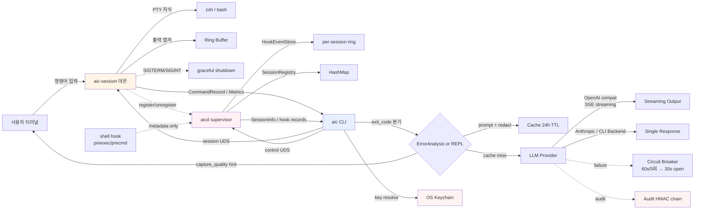
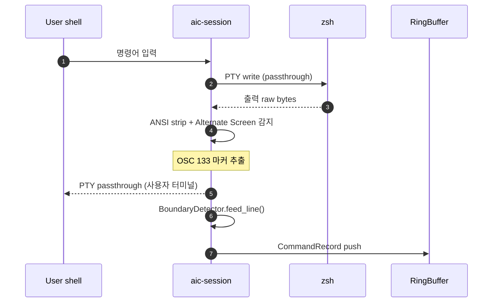
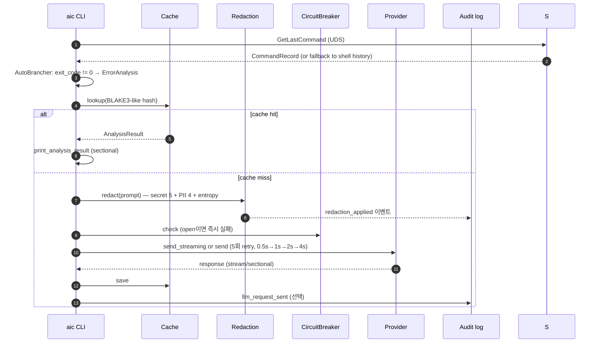
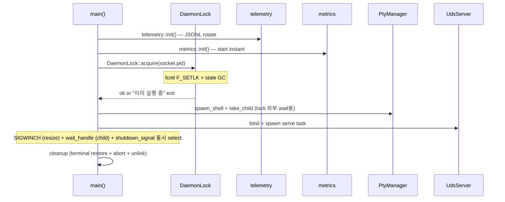
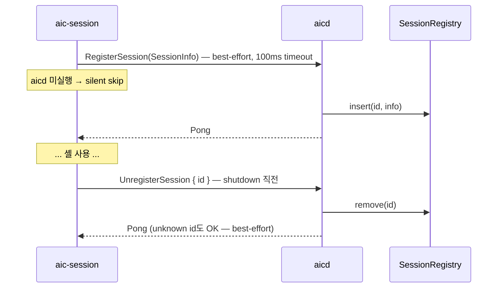
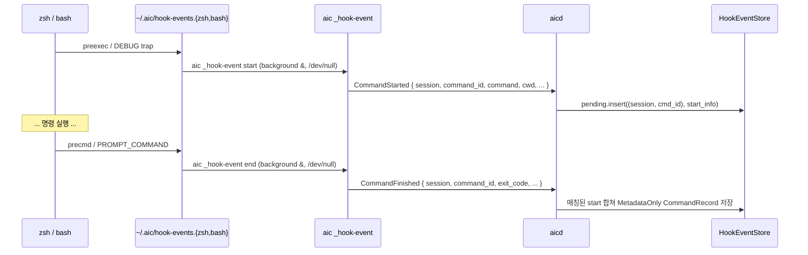
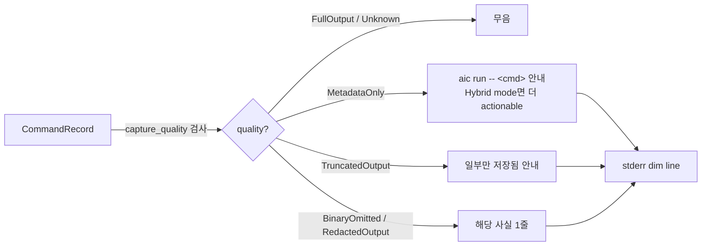

# Architecture

> aic — 셸 명령어 에러를 LLM으로 자동 분석/제안하는 Rust CLI 도구의 구조 설명. 모든 결정 기록은 [CHANGELOG.md](./CHANGELOG.md) 참조.

## High-Level



**Two daemons, separate planes**:
- `aic-session` (per-terminal): **data plane** — PTY wrapper + RingBuffer + 출력
  캡처. 변경 없음.
- `aicd` (per-user, singleton): **control plane** — registry / lifecycle /
  hook event sink. 출력을 소유하지 않으므로 RingBuffer 결합 없는 별도
  `ControlServer`를 사용한다.
- 두 데몬은 직교한다 — `aicd` 없이도 `aic-session`은 정상 동작하고, hook
  mode는 `aic-session` 없이도 metadata만 수집한다.

## Workspace 구조

```
ac-rust/
├── aic-common/          # 공유 타입, IPC 프로토콜, 에러
│   └── src/
│       ├── lib.rs       # AppConfig, LlmConfig, ProviderConfig, AnalysisResult, MetricsSnapshot, resolve_lang
│       ├── ipc.rs       # IpcRequest/Response, encode_frame/decode_frame
│       ├── error.rs     # AicError + user_message + is_retryable
│       └── paths.rs     # default_socket_path, resolve_socket_path
│
├── aic-server/          # 두 binary: aic-session + aicd
│   └── src/
│       ├── main.rs              # aic-session: telemetry → PID lock → PTY → UDS
│       │                        # → aicd register → SIGWINCH/wait
│       ├── aicd_main.rs         # aicd: telemetry → DaemonLock(aicd.pid) →
│       │                        # ControlServer(aicd.sock) → SIGINT/SIGTERM
│       ├── control_server.rs    # aicd control plane (RingBuffer-free).
│       │                        # ControlContext { shutdown, registry, hook_events }
│       ├── session_registry.rs  # Arc<RwLock<HashMap<id, SessionInfo>>>.
│       │                        # register/unregister/set_state/list/len.
│       ├── hook_events.rs       # per-session bounded ring (cap 64). pending
│       │                        # start ↔ finish 매칭, MetadataOnly record 생성.
│       ├── aicd_client.rs       # aic-session → aicd best-effort RPC.
│       │                        # 100ms timeout, silent skip if aicd down.
│       ├── pty_manager.rs       # PtyManager (master + child Option). take_child()
│       ├── output_processor.rs  # ANSI strip + Alternate Screen 감지 + OSC 133
│       ├── boundary_detector.rs # OSC 133 또는 timing heuristic으로 경계 감지
│       ├── ring_buffer.rs       # 출력 라인 인메모리 buffer
│       ├── uds_server.rs        # 세션 IPC 핸들러 (RingBuffer 결합)
│       ├── lock.rs              # fcntl(F_SETLK) PID lock + stale GC
│       ├── telemetry.rs         # tracing-subscriber + appender
│       └── metrics.rs           # uptime + ipc_request_count
│
└── aic-client/          # CLI 클라이언트 (바이너리: aic)
    └── src/
        ├── main.rs              # clap CLI: 11+ subcommand + --dry-run flag
        ├── hook_install.rs      # zsh/bash hook script generator + RC marker
        ├── uds_client.rs        # session + aicd control client.
        │                        # list_sessions/stop_session/shutdown/send_raw 추가
        ├── doctor.rs            # 9축 진단 (aicd supervisor 포함)
        ├── config.rs            # ConfigManager (TOML 로드/저장)
        ├── llm_dispatcher.rs    # LLM Provider 라우터: send/send_streaming
        │                        # + send_messages/supports_tool_calling (RFC-002)
        ├── error_analyzer.rs    # build_prompt + parse_response + clean
        ├── streaming.rs         # OpenAI compat SSE 파서
        ├── repl.rs              # Interactive REPL (비-tool 폴백 + 공유 헬퍼)
        │                        # + LineReader(reedline: slash 후보 패널·CJK·history, 비-TTY fallback)
        ├── agent/               # RFC-002 Phase 1~2 agent
        │   ├── types.rs         # ChatMessage/ToolCall/ToolSpec/ChatResponse wire
        │   ├── sandbox.rs       # cwd canonical 샌드박스 (경로 탈출 차단)
        │   ├── tools.rs         # read_file/list_dir/grep/glob + registry (read-only)
        │   ├── run_command.rs   # SRE run_command (validator+risk_guard+confirm, 기본 활성)
        │   ├── gitignore.rs     # .gitignore/.git/info/exclude 매처
        │   ├── debug.rs         # AIC_DEBUG agent 로그 헬퍼 (NO_COLOR/non-TTY 색상 게이트)
        │   ├── ui.rs            # ASCII banner + status line + prompt + 색상/폭 처리
        │   ├── tool_record.rs   # P2-1 in-memory tool 기록 ring + slash 명령/파서/자동완성
        │   ├── sysinfo.rs       # /local 내장 sysinfo probe 목록(개별 bounded Safe 명령)
        │   ├── markdown.rs      # CLI 친화 markdown subset → ANSI 렌더(의존성 없는 순수 fn, CJK wrap)
        │   ├── diagnose.rs      # /diagnose 증상→결정적 Safe probe 선택 + 진단 prompt(순수 fn)
        │   └── session.rs       # AgentSession agent loop (SRE preface, degrade 폴백)
        ├── auto_brancher.rs     # ErrorAnalysis vs InteractiveRepl 분기
        ├── cache.rs             # 결과 캐시 (24h TTL)
        ├── redaction.rs         # secret 5종 + PII 4종 + entropy
        ├── audit.rs             # HMAC-SHA256 chain
        ├── keychain.rs          # OS keychain 통합
        └── spinner.rs           # tokio 비동기 spinner
```

## 핵심 데이터 흐름

### 1) 셸 명령어 → CommandRecord


### 2) `aic` 호출 → 분석


### 3) 데몬 lifecycle


## 설계 원칙

### 단일 인스턴스 + Forward Compatibility
- `fcntl(F_SETLK)` 하나로 데몬 충돌 자체를 막음 → 네임스페이스 멀티 소켓 불필요
- IPC `IpcRequest` 역직렬화 실패 시 graceful `IpcResponse::Error` (옛/새 client·server 호환)

### 보안 baseline (judge2 FAIL → PASS 보강)
| 차원 | 모듈 | 정책 |
|---|---|---|
| Secret 누출 | `redaction.rs` | 5종 prefix + Shannon entropy ≥3.0. LLM 송신 직전 단일 stage. `AIC_REDACT=off` opt-out |
| PII | `redaction.rs` | 4종 정형 매칭 (entropy 무관) |
| API key 평문 | `keychain.rs` | OS keychain reference (`keychain:<provider>`). `aic migrate-keys` 일괄 이동 |
| 감사 | `audit.rs` | JSONL append-only + HMAC-SHA256 line chain. `aic audit verify` (exit 0/2/3) |
| 데이터 본문 보존 금지 | tracing/audit 양쪽 | hash + token count만, prompt/response 본문 미저장 |

### 가시성
- **데몬 측 (long-running)**: `tracing` JSONL daily rotate (7일) + atomic counter metrics + `IpcRequest::GetMetrics`로 client 노출
- **클라이언트 측 (단발)**: `[debug +X.XXXs]` prefix 매크로 + cumulative 시간 표시 + `aic doctor` 8축 진단

### 데드락 회피 (실제 발견 + 수정)
PtyManager를 `Arc<Mutex<...>>`로 공유했을 때 wait_handle이 `wait_for_exit()`로 lock을 자식 셸 종료까지 영구 점유 → SIGWINCH 핸들러가 영원히 lock 대기. **fix**: `take_child()`로 child handle을 spawn 직전에 분리, lock 해제 후 lock 밖에서 `child.wait()`. 진단 도구로는 macOS `sample <pid> 2`가 결정적 단서 (`pthread_mutex_firstfit_lock_wait` thread state).

### LLM Layer 정책
| 정책 | 임계 | 위치 |
|---|---|---|
| Connect timeout | 5s | `LlmDispatcher::from_config` |
| Request timeout | 30s | 동일 |
| Retry | 5회, 0.5s/1s/2s/4s exponential backoff | `LlmDispatcher::send` |
| Retry 대상 | HTTP 5xx, 429, network (status=0) | `AicError::is_retryable` |
| Circuit breaker | 60s window 5회 실패 → 30s open | `CircuitBreaker::record_failure` |
| Streaming | OpenAI compat + TTY + `AIC_NO_STREAM` 미설정 | `main.rs::handle_default` |
| Tool-calling (RFC-002) | OpenAI compat 경로만, 송신 전 redaction | `LlmDispatcher::send_messages` |
| Agent 폴백/degrade | non-compat은 `ReplSession`, tools 거부 시 단발 `send()` degrade | `main.rs::handle_chat`, `agent::session` |
| run_command 기본 활성 | `aic chat` 기본 on, `--no-run`/`--read-only`/`AIC_AGENT_NO_RUN`로 off | `main.rs::chat_run_command_enabled` |
| run_command 안전 | risk_guard + validator + confirm + sandbox/env/redaction/timeout | `agent::run_command` |

### Agent Layer (RFC-002 Phase 1~2)

`aic chat`은 capability 게이트로 분기한다. provider가 OpenAI compat(`supports_tool_calling`)이면
`AgentSession`이 `send_messages` + 도구로 tool-calling loop를 돈다(max-iteration=8 안전 종료).
provider가 tools를 거부하면(4xx/ConfigError) 일반 대화로 degrade한다.

**도구 구성**
- 읽기 전용 4종(`read_file`/`list_dir`/`grep`/`glob`): 항상 노출. **canonical cwd 샌드박스**로
  제한되고 **`.gitignore`/`.git/info/exclude`**·secrets·hidden·binary 규칙으로 필터된다.
- `run_command`(SRE 셸 실행, Phase 2): **기본 활성(default-on)**. `--no-run`/`--read-only`/
  `AIC_AGENT_NO_RUN=1`로 끄면 read-only 세션. AIC_DEBUG 로그상 `tools=5`(default) / `tools=4`(opt-out).

**run_command 안전 파이프라인** (`agent::run_command`)
1. SRE shortcut normalize — `ps`/`process`/`cpu` ⇒ `ps aux | head -n 20`, `disk` ⇒ `df -h`,
   `memory`/`net`은 OS별 bounded 명령. 단순 의도를 bounded canonical로 변환.
2. `risk_guard::classify` ⇒ **Safe**=자동 실행, **NeedsConfirm**=TTY confirm(비-TTY는 거부),
   **Dangerous/Unknown**=차단. 네트워크 정책: `curl`/`wget`은 GET 포함 NeedsConfirm
   (`http.egress`/`http.write`); DNS 도구의 custom resolver/explicit server는 NeedsConfirm
   (`dns.custom_resolver`, 기본 resolver 조회는 Safe); `ssh`/`scp`/`nc`/`socat`/`telnet` 등 원격
   접속 도구는 명시적 **Dangerous**(`net.remote_access`).
3. validator(샌드박스 강제): `$`·glob/brace(`* ? [ ] { }`)·따옴표·백슬래시·redirect(`> <`)·`;`·`&`·
   `||`·newline/CR·`~`·backtick·절대경로 인자·`..`·find/fd 위험 옵션(`-exec`/`-delete` 등) 차단.
   `|`(pipe)는 허용하되 segment별 argv 검증. 패턴/고급 셸은 grep/glob tool 또는 후속 argv runner로 처리.
4. 실행: `sh -c`, cwd=sandbox, env allowlist만 전달(API key 미전달), child를 process group leader로
   두고 timeout(기본 15s/하드캡 30s) 시 그룹 전체 SIGKILL(descendant 포함). stdout/stderr는 bounded
   read(64KB 저장 cap + 드레인 상한)로 회수해 unbounded alloc·join hang 방지. truncated 시 hint 추가.
5. 결과는 LLM 전달 전 `redaction::redact` 적용, 실행/차단/거부/timeout은 `audit::append` 기록.

**Slash 명령 (P2-1, `agent::tool_record`)** — agent REPL은 LLM 전송 전 `/`-입력을 가로챈다:
`/help`, `/last [N]`(직전 카드 / 최근 N개 요약), `/raw [seq|corr]`(redacted 전체, cap 시 라벨),
`/local [section]`(alias `/sys`·`/snapshot`). tool 실행은 in-memory ring(상한 20)에 저장 시 항상
redact해 기록하고, slash는 history/LLM에 보내지 않고 stderr로만 출력(stdout 미오염). 비-agent
`ReplSession`은 slash가 agent 전용임을 안내. persistent audit 파일 조회(`/audit`)는 **P2-2** 보류.

**/local 로컬 스냅샷 + 분석 (`agent::sysinfo`)** — date/host/os/uptime/disk/memory/ip/route/ports를 OS별
**개별 bounded Safe 명령**(shell chain 없음)으로 `run_command::execute_with_corr`로 실행 → timeout/
cap/redaction/audit/`corr` 동일 적용, 결과는 ring에 남아 `/last`·`/raw`로 재조회. read-only 세션 비활성.
**기본 동작은 LLM 분석 요약**: redacted 스냅샷을 `dispatcher.send`(tool 없는 stateless 단발, history
미push)로 보내 요약하고 stderr로 출력. 프롬프트(`tool_record::build_local_analyze_prompt`)는 스냅샷을
데이터로만 취급해 injection을 막고 읽기 전용 진단으로 고정. provider 미설정/오류/`LOCAL_ANALYZE_TIMEOUT`(30s)
초과 시 **raw 스냅샷으로 fallback**(짧은 사유). `--raw`/`AIC_LOCAL_NO_ANALYZE`면 분석 생략. 분석/fallback
여부는 audit(`local_analyze`)·`AIC_DEBUG`에 기록. 분석 출력은 `agent::markdown::render_markdown`(의존성
없는 in-house, CJK 폭 wrap)로 렌더 — TTY=ANSI 구조, NO_COLOR(TTY)=색 없이 구조만, non-TTY(파이프)=raw
markdown 그대로(렌더 끔). 분석 prompt에 "CLI 친화 markdown subset(표/HTML 금지)" 제약. 스트리밍은
buffer-then-render(P1); raw/fallback 출력에는 렌더 미적용. 강조색은 amber/yellow(`markdown::AMBER`
=256색 `38;5;214`, 단일 상수)로 heading·bullet·inline code에만(본문 기본 fg). 분석 진행은 amber
`spinner::Spinner::start_styled(label, color)`(provider 라벨, TTY-only, 성공/실패/timeout 정리),
NO_COLOR/non-TTY는 plain·no-op.

**/diagnose 진단 (`agent::diagnose`)** — 증상 키워드 → 카테고리(cpu/memory/disk/network/process/generic,
순수 `select_probes`) → 고정 Safe probe(date/host/os base + 카테고리; process=`ps aux | head`) 수집
(`collect_local_snapshot` 재사용) → 증상+증거를 `run_analysis`(tool-less stateless 단발, history 미push)로
분석. prompt(`build_diagnose_prompt`)는 가설→증거 인용→다음 안전 확인을 요구하고 증거를 데이터로만 취급
(injection 방지)·read-only 고정. `--raw`/`AIC_LOCAL_NO_ANALYZE`=증거만, 실패 시 raw fallback. audit
kind=`diagnose`, corr가 probe들+분석을 한 진단으로 묶음. 렌더(amber)·spinner는 `/local`과 공유.

**`/explain-last` · `/incident`** — `/explain-last [--raw] [seq|corr]`은 ring의 최근(또는 지정) tool
기록(`tool_record::record_evidence`)을 증거로 원인/다음확인 분석(새 명령 실행 없음 → read-only 세션도
동작). `/incident [--raw] [name]`은 시스템 스냅샷(`sysinfo`) + git read-only 증거(repo일 때만, 고정 Safe
상수 `git status/branch/log/diff`) + 최근 기록(`recent_records_evidence`)을 묶어 분석. **name은 라벨 전용
으로 셸 명령에 미포함**. 둘 다 `build_explain_last_prompt`/`build_incident_prompt`(증거=data-only,
injection 방지) + `run_analysis`(stateless·tool-less·history 미push) + `analysis_fallback` 재사용,
audit kind=`explain-last`/`incident`.

**운영 slash (P0, LLM 미호출)** — `/doctor`(`build_doctor_report` 순수: provider/model 식별자·tool-calling·
run_command·env flag **set/unset만**, secret/config dump 없음), `/timeline [N]`(`render_timeline`, tool 기록
시간순), `/compare`(고정 Safe 스냅샷 → `snapshot_diff` line-set diff, baseline은 세션 필드 `compare_baseline`,
LLM 없음), `/bundle [name]`(`write_bundle`: 인시던트 증거를 redacted markdown으로 `~/.aic/bundles/`에 저장,
파일명 `sanitize_bundle_name`, dir 0700/file 0600 unix, name은 라벨이라 셸 명령 미포함). 모두 collect_local_
snapshot/risk_guard/redaction/corr 재사용, provider egress·history push 없음. 보류 roadmap: `/runbook`·
`/fix-preview`·`/config`·watch daemon·persistent `/audit` 조회.

**Slash 후보 선택형 패널 (reedline)** — `repl::LineReader`는 **reedline** 기반(rustyline 이주 완료).
TTY에서 `SlashCompleter`(`tool_record::slash_completion_entries` 재사용: value=이름, description=설명,
append_whitespace)가 `ColumnarMenu`("completion_menu")에 후보를 채운다. 키바인딩(`slash_keybindings`,
기본 emacs + Tab·`/` 추가): **`/`**=문자 삽입 직후 메뉴 즉시 열림(`Multiple([Edit(InsertChar('/')), Menu]`),
reedline 0.39엔 buffer-change hook이 없어 키 이벤트로 묶음; 후보 없으면 메뉴는 비어 자연히 닫힘),
**Tab**=메뉴 열기/순환, **↑↓**=메뉴 열림 시 항목 이동(선택행 highlight)/닫힘 시 history, **Enter**=선택/제출,
**Esc**=닫기(라인 보존). `/local <section>` 섹션 완성. 매칭은 **prefix 우선 + subsequence(fuzzy) 폴백**
(`match_candidates`). 메뉴 색상은 `ui::color_enabled()`(NO_COLOR/non-TTY)면 비활성(선택행 reverse만).
history는 `FileBackedHistory`(`~/.config/aic/chat_history`), 프롬프트는 `AicPrompt`(Prompt trait). 비-TTY는
reedline 미생성 → 기존 `read_line` 폴백. `LineReader` 공개 API(new/read/ReadLine/Drop) 불변 → 호출부 무변경.

**Correlation id** — `AgentSession`은 세션 `run_id` + tool call별 `run_id.seq`(=`corr`)를 부여한다.
AIC_DEBUG `tool_call`/`tool_result`, run_command command card, audit JSON(`corr`), degrade
audit(`run_id`)이 같은 id를 공유해 stderr/디버그/감사 로그를 한 호출 단위로 추적할 수 있다
(stdout LLM 답변에는 미노출). argv runner / 외부 egress allowlist 실허용은 **P2**.

**대화형 입력** — `repl::LineReader`(reedline): CJK 입력 편집·up/down history(`~/.config/aic/chat_history`),
비-TTY는 `stdin().read_line` fallback. SRE 모드면 system preface에 SRE 지침을 덧붙인다.
(slash 후보 패널·키바인딩 세부는 아래 "Slash 후보 선택형 패널" 참조.)

**터미널 UI** (`agent::ui`) — line-based 전용(fullscreen TUI 미사용).
- **banner**: TTY면 ASCII art(cyan bold), non-TTY면 plain 1줄. 시작 시 stderr로 출력(AIC_DEBUG와 무관 가시).
- **status line**: SRE on/read-only·tools 목록·run_command policy·cwd·provider·model·opt-out 안내.
  폭<64면 compact 2줄로 축약(`▌` bar prefix). degrade 시 status note.
- **prompt**: stdin && stdout 모두 TTY면 `◇ you ❯ `, 아니면 ASCII `you> `(LineReader fallback 조건과
  일치 → stdout-stderr 분리 유지).
- **스트림 분리**: LLM 답변은 **stdout**(`print_with_border`), banner/status/command card/provenance/
  debug는 **stderr**.
- **색상 정책**: `color_enabled() = NO_COLOR 미설정 && stderr TTY`. non-TTY 또는 `NO_COLOR=1`이면
  banner/status/card/debug 로그에 ANSI escape를 출력하지 않는다.

**디버그** — `AIC_DEBUG=1|true`이면 stderr에 `[debug +X.XXXs]` 라인. agent loop는 structured copy
(`tool_specs=N run_command=on|off provider_tools=enabled|degraded|off`, `tool_call`/`tool_result`)를
grep 가능하게 출력. 색상은 위 정책을 따른다. banner는 AIC_DEBUG에서도 계속 보인다.

**GA Gate** (P0 반영 완료 — [docs/PRD-AIC-SRE-CHAT.md](./docs/PRD-AIC-SRE-CHAT.md) §13)
- **G1 tool-calling live probe** (✅): opt-in `aic doctor --probe-tools`가 최소 tool spec으로
  `send_messages` 1회를 보내 ok/unsupported/degraded/error/skip 진단(세션 시작 자동 아님). 런타임
  degrade 시 1회 명시 고지 + `provider_tools=degraded`(AIC_DEBUG) + audit `tool_calling_degraded`.
  (P1) 자동 캐시 probe.
- **G2 GET egress / exfil 정책** (✅): `curl`/`wget`을 GET 포함 전부 **NeedsConfirm**으로 분류
  (`risk_guard`: GET=`http.egress`, POST/upload/output=`http.write`) → GET 쿼리스트링 exfil이 비-TTY에서
  자동 거부. (P1) egress host allowlist + 레드팀.

## CLI 표면

11+ subcommand + 1 root flag:

```
aic config [show|get <path>]                   # 설정 (wizard / CI 출력)
aic doctor [--json] [--probe-tools]            # 9축 진단 + opt-in tool-calling live probe
aic status [--watch] [--interval N] / aic top  # 데몬 상태 + metrics
aic sessions                                   # aicd registry-first 세션 목록
aic audit verify                               # HMAC chain (exit 0/2/3)
aic migrate-keys                               # 평문 → keychain 일괄 이동
aic init <shell> [--hook-mode]                 # rc hook source + (옵션) hook-mode
aic daemon { status | start | stop }           # aicd supervisor 제어
aic session stop <id>                          # registry 기반 세션 종료
aic run -- <cmd...>                            # explicit FullOutput capture
aic chat ["<prompt>"] [--dry-run] [--context] [--no-run|--read-only]  # SRE agent(run_command 기본 on)
aic _hook-event { start | end }                # (hidden) shell hook → aicd
aic --dry-run "<prompt>"                       # 토큰·비용·timeout 미리보기
aic --version
```

### 새 데이터 흐름 (Phase 1~4)

#### 4) 세션 등록 / 해제


#### 5) Hook capture mode (PTY 없음)


#### 6) Capture quality hint


## 테스트

| Crate | 형태 |
|---|---|
| aic-common | property-based (proptest) IPC/AppConfig roundtrip + capture mode/quality + hint helper + legacy compat |
| aic-server | unit (lock / control_server / session_registry / hook_events / aicd_client / boundary / output / ring / uds / telemetry / metrics) |
| aic-client | unit (redaction / audit / cache / doctor / hook_install / circuit / streaming / spinner / keychain / agent(types·sandbox·tools·gitignore·session) + 외) |

> 현재 통과 개수는 `cargo test --workspace`로 직접 확인한다(고정 수치는 stale해지므로 명시하지 않음).

`cargo test --workspace --no-fail-fast -- --test-threads=1` 직렬 실행 권장
(통합 테스트가 `/tmp/aic-{uid}/` 공유 디렉토리를 쓰므로).

`cargo clippy --workspace --all-targets -- -D warnings` ✅ 깨끗.

## 미해결 / 후속

자세한 결정 기록은 [CHANGELOG.md](./CHANGELOG.md)의 `Architectural Decisions` 섹션 참조.

- **launchd/systemd unit 자동 설치** — PTY-wrapping 모델 재설계 RFC 후
- **streaming Anthropic provider** — 현재 OpenAI compat만
- **ratatui 진정한 TUI** — `aic top`은 현재 polling 텍스트
- **OSC 8 hyperlink** — URL handler 등록 비용 재평가
