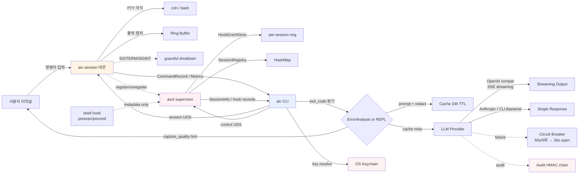
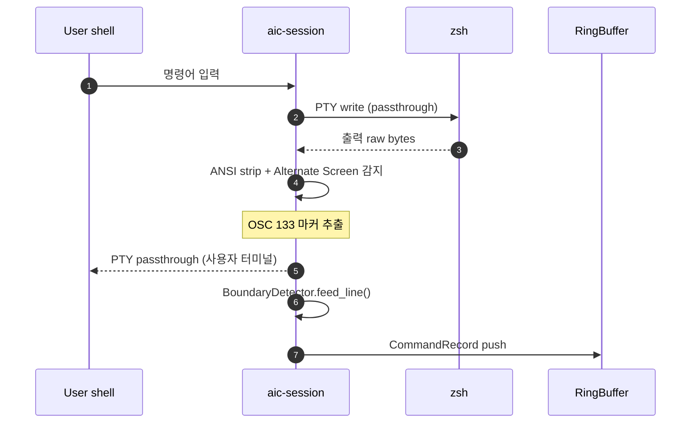
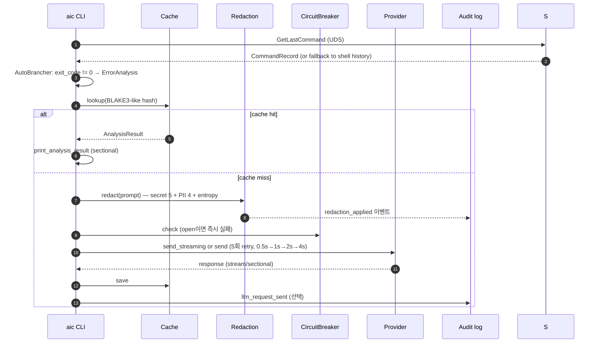
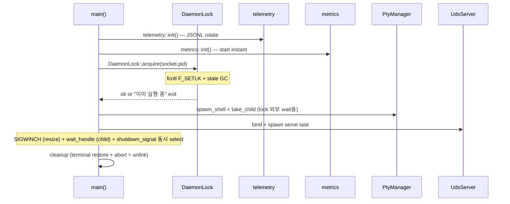
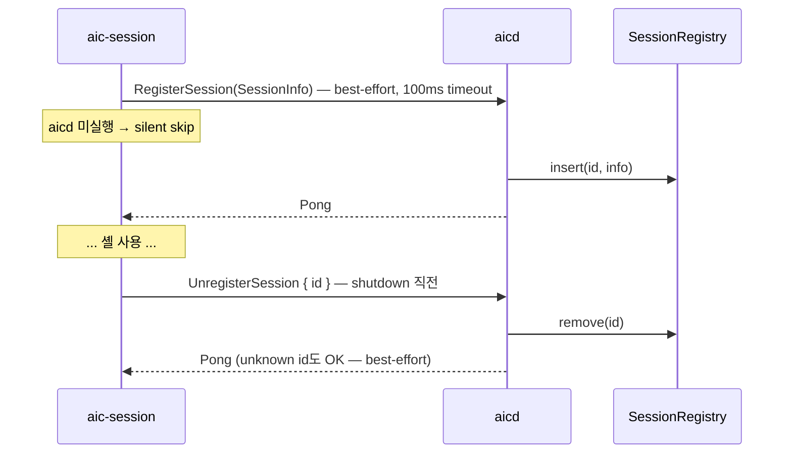
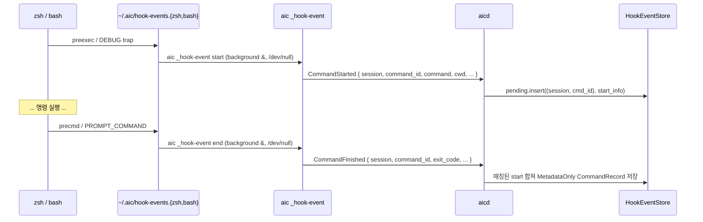
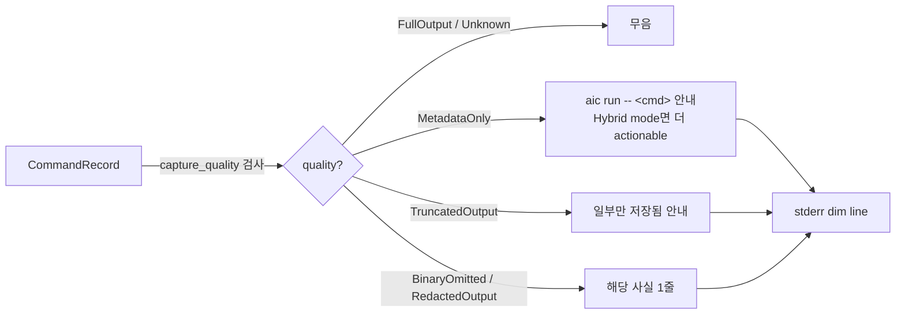

# Architecture

> aic — 셸 명령어 에러를 LLM으로 자동 분석/제안하는 Rust CLI 도구의 구조 설명. 모든 결정 기록은 [CHANGELOG.md](./CHANGELOG.md) 참조.

## High-Level



**Two daemons, separate planes**:
- `aic-session` (per-terminal): **data plane** — PTY wrapper + RingBuffer + 출력
  캡처. 변경 없음.
- `aicd` (per-user, singleton): **control plane** — registry / lifecycle /
  hook event sink. 출력을 소유하지 않으므로 RingBuffer 결합 없는 별도
  `ControlServer`를 사용한다.
- 두 데몬은 직교한다 — `aicd` 없이도 `aic-session`은 정상 동작하고, hook
  mode는 `aic-session` 없이도 metadata만 수집한다.

## Workspace 구조

```
ac-rust/
├── aic-common/          # 공유 타입, IPC 프로토콜, 에러
│   └── src/
│       ├── lib.rs       # AppConfig, LlmConfig, ProviderConfig, AnalysisResult, MetricsSnapshot, resolve_lang
│       ├── ipc.rs       # IpcRequest/Response, encode_frame/decode_frame
│       ├── error.rs     # AicError + user_message + is_retryable
│       └── paths.rs     # default_socket_path, resolve_socket_path
│
├── aic-server/          # 두 binary: aic-session + aicd
│   └── src/
│       ├── main.rs              # aic-session: telemetry → PID lock → PTY → UDS
│       │                        # → aicd register → SIGWINCH/wait
│       ├── aicd_main.rs         # aicd: telemetry → DaemonLock(aicd.pid) →
│       │                        # ControlServer(aicd.sock) → SIGINT/SIGTERM
│       ├── control_server.rs    # aicd control plane (RingBuffer-free).
│       │                        # ControlContext { shutdown, registry, hook_events }
│       ├── session_registry.rs  # Arc<RwLock<HashMap<id, SessionInfo>>>.
│       │                        # register/unregister/set_state/list/len.
│       ├── hook_events.rs       # per-session bounded ring (cap 64). pending
│       │                        # start ↔ finish 매칭, MetadataOnly record 생성.
│       ├── aicd_client.rs       # aic-session → aicd best-effort RPC.
│       │                        # 100ms timeout, silent skip if aicd down.
│       ├── pty_manager.rs       # PtyManager (master + child Option). take_child()
│       ├── output_processor.rs  # ANSI strip + Alternate Screen 감지 + OSC 133
│       ├── boundary_detector.rs # OSC 133 또는 timing heuristic으로 경계 감지
│       ├── ring_buffer.rs       # 출력 라인 인메모리 buffer
│       ├── uds_server.rs        # 세션 IPC 핸들러 (RingBuffer 결합)
│       ├── lock.rs              # fcntl(F_SETLK) PID lock + stale GC
│       ├── telemetry.rs         # tracing-subscriber + appender
│       └── metrics.rs           # uptime + ipc_request_count
│
└── aic-client/          # CLI 클라이언트 (바이너리: aic)
    └── src/
        ├── main.rs              # clap CLI: 11+ subcommand + --dry-run flag
        ├── hook_install.rs      # zsh/bash hook script generator + RC marker
        ├── uds_client.rs        # session + aicd control client.
        │                        # list_sessions/stop_session/shutdown/send_raw 추가
        ├── doctor.rs            # 9축 진단 (aicd supervisor 포함)
        ├── config.rs            # ConfigManager (TOML 로드/저장)
        ├── llm_dispatcher.rs    # LLM Provider 라우터: send/send_streaming
        ├── error_analyzer.rs    # build_prompt + parse_response + clean
        ├── streaming.rs         # OpenAI compat SSE 파서
        ├── repl.rs              # Interactive REPL
        ├── auto_brancher.rs     # ErrorAnalysis vs InteractiveRepl 분기
        ├── cache.rs             # 결과 캐시 (24h TTL)
        ├── redaction.rs         # secret 5종 + PII 4종 + entropy
        ├── audit.rs             # HMAC-SHA256 chain
        ├── keychain.rs          # OS keychain 통합
        └── spinner.rs           # tokio 비동기 spinner
```

## 핵심 데이터 흐름

### 1) 셸 명령어 → CommandRecord


### 2) `aic` 호출 → 분석


### 3) 데몬 lifecycle


## 설계 원칙

### 단일 인스턴스 + Forward Compatibility
- `fcntl(F_SETLK)` 하나로 데몬 충돌 자체를 막음 → 네임스페이스 멀티 소켓 불필요
- IPC `IpcRequest` 역직렬화 실패 시 graceful `IpcResponse::Error` (옛/새 client·server 호환)

### 보안 baseline (judge2 FAIL → PASS 보강)
| 차원 | 모듈 | 정책 |
|---|---|---|
| Secret 누출 | `redaction.rs` | 5종 prefix + Shannon entropy ≥3.0. LLM 송신 직전 단일 stage. `AIC_REDACT=off` opt-out |
| PII | `redaction.rs` | 4종 정형 매칭 (entropy 무관) |
| API key 평문 | `keychain.rs` | OS keychain reference (`keychain:<provider>`). `aic migrate-keys` 일괄 이동 |
| 감사 | `audit.rs` | JSONL append-only + HMAC-SHA256 line chain. `aic audit verify` (exit 0/2/3) |
| 데이터 본문 보존 금지 | tracing/audit 양쪽 | hash + token count만, prompt/response 본문 미저장 |

### 가시성
- **데몬 측 (long-running)**: `tracing` JSONL daily rotate (7일) + atomic counter metrics + `IpcRequest::GetMetrics`로 client 노출
- **클라이언트 측 (단발)**: `[debug +X.XXXs]` prefix 매크로 + cumulative 시간 표시 + `aic doctor` 8축 진단

### 데드락 회피 (실제 발견 + 수정)
PtyManager를 `Arc<Mutex<...>>`로 공유했을 때 wait_handle이 `wait_for_exit()`로 lock을 자식 셸 종료까지 영구 점유 → SIGWINCH 핸들러가 영원히 lock 대기. **fix**: `take_child()`로 child handle을 spawn 직전에 분리, lock 해제 후 lock 밖에서 `child.wait()`. 진단 도구로는 macOS `sample <pid> 2`가 결정적 단서 (`pthread_mutex_firstfit_lock_wait` thread state).

### LLM Layer 정책
| 정책 | 임계 | 위치 |
|---|---|---|
| Connect timeout | 5s | `LlmDispatcher::from_config` |
| Request timeout | 30s | 동일 |
| Retry | 5회, 0.5s/1s/2s/4s exponential backoff | `LlmDispatcher::send` |
| Retry 대상 | HTTP 5xx, 429, network (status=0) | `AicError::is_retryable` |
| Circuit breaker | 60s window 5회 실패 → 30s open | `CircuitBreaker::record_failure` |
| Streaming | OpenAI compat + TTY + `AIC_NO_STREAM` 미설정 | `main.rs::handle_default` |

## CLI 표면

11+ subcommand + 1 root flag:

```
aic config [show|get <path>]                   # 설정 (wizard / CI 출력)
aic doctor [--json]                            # 9축 진단 (aicd 포함)
aic status [--watch] [--interval N] / aic top  # 데몬 상태 + metrics
aic sessions                                   # aicd registry-first 세션 목록
aic audit verify                               # HMAC chain (exit 0/2/3)
aic migrate-keys                               # 평문 → keychain 일괄 이동
aic init <shell> [--hook-mode]                 # rc hook source + (옵션) hook-mode
aic daemon { status | start | stop }           # aicd supervisor 제어
aic session stop <id>                          # registry 기반 세션 종료
aic run -- <cmd...>                            # explicit FullOutput capture
aic _hook-event { start | end }                # (hidden) shell hook → aicd
aic --dry-run "<prompt>"                       # 토큰·비용·timeout 미리보기
aic --version
```

### 새 데이터 흐름 (Phase 1~4)

#### 4) 세션 등록 / 해제


#### 5) Hook capture mode (PTY 없음)


#### 6) Capture quality hint


## 테스트

| Crate | Lib tests | 형태 |
|---|---|---|
| aic-common | 64 | property-based (proptest) IPC/AppConfig roundtrip + capture mode/quality + hint helper + legacy compat |
| aic-server | 95 | unit (lock 8 / control_server 8 / session_registry 7 / hook_events 4 / aicd_client 4 / boundary / output / ring / uds 13+ / telemetry / metrics) |
| aic-client | 162 | unit (redaction 21 + audit 8 + cache 7 + doctor 7 + hook_install 3 + circuit / streaming / spinner / keychain + 외) |

`cargo test --workspace --no-fail-fast -- --test-threads=1` 직렬 실행 권장
(통합 테스트가 `/tmp/aic-{uid}/` 공유 디렉토리를 쓰므로).

`cargo clippy --workspace --all-targets -- -D warnings` ✅ 깨끗.

## 미해결 / 후속

자세한 결정 기록은 [CHANGELOG.md](./CHANGELOG.md)의 `Architectural Decisions` 섹션 참조.

- **launchd/systemd unit 자동 설치** — PTY-wrapping 모델 재설계 RFC 후
- **streaming Anthropic provider** — 현재 OpenAI compat만
- **ratatui 진정한 TUI** — `aic top`은 현재 polling 텍스트
- **OSC 8 hyperlink** — URL handler 등록 비용 재평가
