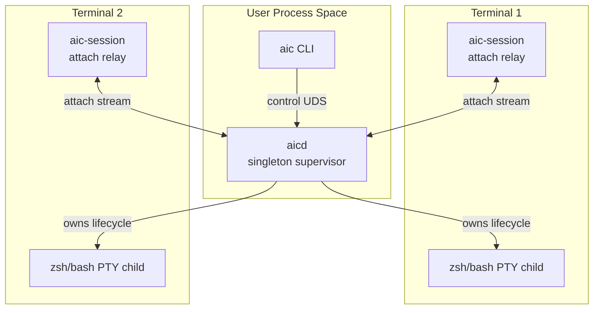

# PRD: aicd Supervisor Daemon

> 사용자당 하나의 장기 실행 데몬(`aicd`)으로 세션 상태를 중앙 관리하고, 터미널별 `aic-session`은 얇은 attach/relay 프로세스로 축소한다.

## 1. 배경

현재 `aic-session`은 터미널마다 실행되는 foreground PTY wrapper다. 각 인스턴스가 셸을 spawn하고, 현재 터미널의 stdin/stdout을 PTY와 직접 중계하며, 세션별 UDS 소켓과 PID 파일을 가진다.

이 구조는 여러 터미널을 동시에 쓰는 사용자의 기본 워크플로우에서는 다음 문제를 만든다.

- 사용자가 터미널마다 `aic-session`을 실행해야 한다.
- `aic-session` 비정상 종료 시 `session-*.sock`, `session-*.pid`, PTY child, hook 상태가 남을 수 있다.
- `aic status`, `aic doctor`, `aic top`, `aic sessions`가 세션별 파일 시스템 상태에 의존해 진단 결과가 흔들린다.
- LLM 설정, cache, circuit breaker, metrics, audit/log 상태가 실제로는 사용자 단위 리소스인데 세션 단위처럼 보인다.
- 멀티세션 도입 후 사용자는 “현재 터미널의 세션”과 “실행 중인 전체 세션”을 구분해야 하며, 이 구분이 UX 부담이 된다.

단일 데몬 모델은 이 문제를 줄일 수 있다. 다만 현재처럼 터미널 입출력을 투명하게 래핑하려면 각 터미널의 foreground process가 필요하다. 따라서 본 PRD의 기준안은 “완전한 단일 프로세스”가 아니라 “사용자당 하나의 supervisor daemon + 터미널별 얇은 attach process”다.

## 2. 목표

### 2.1 Product Goals

- 사용자는 터미널마다 무거운 `aic-session` 데몬을 직접 관리하지 않아도 된다.
- `aic-session`이 죽어도 고아 세션, stale socket, stale PID, orphan PTY child가 자동 정리된다.
- `aic status`, `aic doctor`, `aic top`, `aic sessions`는 항상 하나의 신뢰 가능한 control plane(`aicd`)을 기준으로 동작한다.
- 여러 터미널의 command capture는 독립적으로 유지하되, 상태와 lifecycle은 중앙에서 관리한다.
- 기존 PTY wrapper 기반의 출력 캡처 정확도와 TUI 호환성은 유지한다.

### 2.2 Engineering Goals

- 현재 `aic-session`의 PTY relay 로직을 가능한 많이 재사용한다.
- 세션 registry, cleanup, metrics, logs, IPC routing을 `aicd`로 이동한다.
- `aic-session`은 foreground terminal attach 프로세스로 축소한다.
- crash recovery를 명시적인 state machine으로 정의한다.
- launchd/systemd 없이도 동작하되, 이후 user service 설치로 확장 가능하게 한다.

## 3. 비목표

- MVP에서 완전한 “터미널별 foreground 프로세스 0개” 모델은 구현하지 않는다.
- MVP에서 shell hook only 방식으로 PTY wrapper를 대체하지 않는다.
- MVP에서 remote daemon, multi-user daemon, root daemon은 지원하지 않는다.
- MVP에서 모든 OS service manager 통합을 필수로 하지 않는다.
- MVP에서 세션 detach 후 장시간 background shell persistence는 필수로 하지 않는다.

## 4. 사용자 문제

### 4.1 Daily User

개발자는 여러 터미널 탭을 열고 작업한다. 각 탭에서 `aic-session`을 직접 실행해야 하고, 어느 탭이 어떤 세션인지 신경 써야 한다. 세션이 죽으면 `aic`가 히스토리 폴백으로 빠지거나 “세션이 종료됨” 메시지를 보여준다.

### 4.2 Debugging User

문제가 생기면 사용자는 `aic sessions`, `aic status`, `/tmp/aic-{uid}`, server log, PID 파일을 직접 대조해야 한다. 실제 원인이 daemon hang인지, attach 종료인지, socket stale인지 구분하기 어렵다.

### 4.3 Operator / Maintainer

테스트와 이슈 리포트에서 세션 파일 상태가 비결정적이다. 하나의 command path에서 cleanup을 보장하기 어렵고, 사용자 환경의 stale 파일이 재현성을 낮춘다.

## 5. 제안 솔루션

### 5.1 개요

새로운 장기 실행 프로세스 `aicd`를 도입한다.

`aicd`는 사용자당 하나만 실행되며 다음을 관리한다.

- 세션 registry
- 세션별 PTY child lifecycle
- command ring buffer
- UDS control API
- metrics
- stale cleanup
- logs
- LLM cache/circuit breaker 상태
- audit event routing

`aic-session`은 현재 터미널과 `aicd`를 연결하는 foreground attach process가 된다.

`aic-session`의 책임은 다음으로 줄인다.

- 현재 터미널 raw mode 설정과 복원
- stdin/stdout relay
- terminal resize 전달
- attach heartbeat 전달
- 종료 시 detach 요청

### 5.2 프로세스 모델



### 5.3 기준 설계

- `aicd`가 PTY child를 spawn하고 소유한다.
- `aic-session`은 터미널 fd를 직접 들고 `aicd`와 byte stream을 주고받는다.
- 각 attach는 `Session_ID`를 가진다.
- `aicd`는 attach heartbeat를 감시한다.
- attach process가 죽으면 `aicd`는 정책에 따라 PTY child를 종료하거나 detached 상태로 둔다.
- `aic` CLI는 `AIC_SESSION_ID`가 있으면 해당 세션을 조회하고, 없으면 `aicd`의 default/current session 정책을 따른다.

## 6. 주요 사용자 흐름

### 6.1 최초 실행

1. 사용자가 `aic-session`을 실행한다.
2. `aic-session`은 `aicd` UDS에 연결을 시도한다.
3. `aicd`가 없으면 `aic-session`이 `aicd`를 백그라운드로 시작한다.
4. `aic-session`은 `CreateSession` 또는 `AttachSession` 요청을 보낸다.
5. `aicd`는 PTY child를 만들고 `Session_ID`를 반환한다.
6. `aic-session`은 현재 터미널을 raw mode로 바꾸고 relay를 시작한다.

### 6.2 일반 분석

1. 사용자가 셸에서 실패한 명령을 실행한다.
2. `aicd`가 PTY output을 처리하고 command boundary를 감지한다.
3. 사용자가 `aic`를 실행한다.
4. `aic`는 `AIC_SESSION_ID` 또는 current terminal mapping으로 `aicd`에 `GetLastCommand`를 요청한다.
5. `aic`는 기존과 동일하게 에러 분석 또는 REPL로 분기한다.

### 6.3 attach process 비정상 종료

1. `aic-session`이 SIGKILL, terminal close, crash 등으로 종료된다.
2. `aicd`는 heartbeat timeout 또는 stream EOF를 감지한다.
3. `aicd`는 세션 상태를 `Detached`로 변경한다.
4. 기본 정책은 PTY child를 grace period 후 종료한다.
5. `aic status`는 detached/stopping 상태와 정리 예정 시간을 표시한다.

### 6.4 daemon 비정상 종료

1. `aicd`가 죽는다.
2. attach process는 stream error를 감지하고 터미널 raw mode를 복원한다.
3. attach process는 사용자에게 `aicd` 종료를 알리고 종료한다.
4. 다음 `aic-session` 실행 시 stale registry/socket/pid를 정리하고 새 `aicd`를 시작한다.

## 7. 요구사항

### R1. Singleton Supervisor

- `aicd`는 사용자당 하나만 실행되어야 한다.
- `aicd`는 `fcntl(F_SETLK)` 또는 동등한 PID lock으로 중복 실행을 방지해야 한다.
- 기존 `session-*.pid` 중심의 세션별 lock은 `aicd.pid` 중심으로 축소해야 한다.
- `aicd` 시작 시 stale `aicd.sock`, stale registry, stale session artifact를 정리해야 한다.

Acceptance Criteria:

- 동시에 두 개의 `aicd`를 시작하면 하나만 성공한다.
- stale lock이 존재하지만 해당 PID가 없으면 자동 정리된다.
- `aic doctor`가 `aicd` singleton 상태를 PASS/WARN/FAIL로 표시한다.

### R2. Session Registry

- `aicd`는 모든 active/detached/stopping 세션을 registry에 저장해야 한다.
- registry는 최소한 `session_id`, `pid`, `state`, `created_at`, `last_seen_at`, `attached_tty`, `shell`, `cwd`, `last_command_at`을 가져야 한다.
- registry는 crash 후 복구 가능한 파일 또는 재구성 가능한 in-memory + artifact scan 모델이어야 한다.

Acceptance Criteria:

- `aic sessions`가 `aicd` registry를 기준으로 세션 목록을 출력한다.
- 죽은 attach는 heartbeat timeout 후 `Detached` 또는 `Stopping`으로 표시된다.
- 세션 목록이 socket file scan 결과에 직접 의존하지 않는다.

### R3. Thin Attach Process

- `aic-session`은 `aicd`에 attach하고 터미널 relay만 수행해야 한다.
- `aic-session`은 ring buffer, command boundary detector, LLM state를 직접 소유하지 않아야 한다.
- `aic-session`은 종료 시 terminal mode를 반드시 복원해야 한다.
- `aic-session`은 `AIC_SESSION_ID`와 `AIC_SESSION=1`을 child shell 환경에 유지해야 한다.

Acceptance Criteria:

- `aic-session` crash/kill 후 다음 터미널 입력이 깨지지 않는다.
- `aic-session` 프로세스가 죽어도 stale session socket이 남지 않는다.
- `aic-session --help`는 TTY 초기화 없이 도움말을 출력한다.

### R4. PTY Lifecycle Ownership

- PTY child lifecycle은 `aicd`가 소유해야 한다.
- attach 종료 시 PTY child 처리 정책은 설정 가능해야 한다.
- MVP 기본값은 `detach_grace_secs = 5` 후 child 종료다.
- 향후 `keep_alive` 정책을 추가할 수 있어야 한다.

Acceptance Criteria:

- attach가 정상 종료되면 `aicd`가 PTY child를 종료하고 registry에서 제거한다.
- attach가 비정상 종료되면 grace period 후 정리된다.
- cleanup 결과는 `aic logs` 또는 `aic status`에서 확인 가능하다.

### R5. Control API

`aicd`는 control UDS API를 제공해야 한다.

필수 request:

- `Ping`
- `CreateSession`
- `AttachSession`
- `DetachSession`
- `ListSessions`
- `GetSession`
- `GetLastCommand`
- `GetRecentLines`
- `GetMetrics`
- `StopSession`
- `Shutdown`

필수 response:

- `Pong`
- `SessionCreated`
- `SessionAttached`
- `SessionDetached`
- `Sessions`
- `CommandData`
- `Lines`
- `Metrics`
- `Error`

Acceptance Criteria:

- 기존 `aic` CLI의 default flow가 `aicd` control API를 통해 동작한다.
- unknown request는 graceful `Error`로 응답한다.
- protocol version mismatch는 사용자 친화 메시지를 반환한다.

### R6. Status / Doctor / Top UX

- `aic status`는 `aicd` 상태를 1순위로 보여줘야 한다.
- `aic status --session <id>`는 특정 세션 상태를 보여줘야 한다.
- `aic doctor`는 `aicd`, attach, session registry, stale cleanup, keychain, audit, endpoint를 구분해서 진단해야 한다.
- `aic top`은 daemon metrics와 session metrics를 모두 보여줘야 한다.

Acceptance Criteria:

- `aic status`가 더 이상 기본 `session.sock` 존재 여부에 의존하지 않는다.
- `aic doctor`가 “daemon down”과 “current terminal not attached”를 구분한다.
- `aic top`에서 active/detached/stopping 세션 수를 확인할 수 있다.

### R7. Crash Recovery

- `aicd` 시작 시 stale attach/session artifact를 정리해야 한다.
- `aicd`는 attach heartbeat timeout을 감지해야 한다.
- `aicd`는 child process 종료를 감지하고 registry를 갱신해야 한다.
- cleanup은 idempotent해야 한다.

Acceptance Criteria:

- 강제 종료된 `aic-session` 10개가 있어도 다음 `aicd` 시작 시 stale artifact가 정리된다.
- cleanup 중 일부 파일 삭제 실패가 전체 daemon 시작을 막지 않는다.
- cleanup 결과가 structured log에 남는다.

### R8. Backward Compatibility

- 기존 `aic-session` 명령은 계속 사용 가능해야 한다.
- 기존 `AIC_SESSION_ID` 기반 CLI 흐름은 유지되어야 한다.
- 기존 config 파일은 migration 없이 동작해야 한다.
- 기존 `aic init zsh|bash` hook은 최소 수정으로 새 attach flow를 사용할 수 있어야 한다.

Acceptance Criteria:

- 기존 사용자는 설치 후 같은 명령으로 `aic-session`을 실행할 수 있다.
- config migration 없이 `aic config show`, `aic`, `aic doctor`가 동작한다.
- breaking change가 필요한 경우 `aic migrate-config` 또는 clear error를 제공한다.

### R9. Security / Privacy

- `aicd` UDS는 현재 사용자만 접근 가능해야 한다.
- socket directory permission은 `0700`이어야 한다.
- control API는 peer credential 확인을 해야 한다.
- logs/status/report는 API key와 redacted data 원칙을 유지해야 한다.
- attach stream은 local UDS만 사용해야 하며 network bind를 지원하지 않는다.

Acceptance Criteria:

- 다른 UID 프로세스는 `aicd` UDS에 접근할 수 없다.
- `aic report` 또는 `doctor --json`에 secret이 노출되지 않는다.
- destructive control request(`Shutdown`, `StopSession`)는 현재 사용자 프로세스에서만 허용된다.

### R10. Observability

- `aicd`는 structured JSONL log를 남겨야 한다.
- session lifecycle event는 모두 log에 남아야 한다.
- metrics에는 daemon uptime, active sessions, detached sessions, cleanup count, ipc count, attach reconnect count가 포함되어야 한다.
- `AIC_DEBUG=1`은 client-side timing과 daemon request id를 연결할 수 있어야 한다.

Acceptance Criteria:

- 하나의 command 분석 요청을 client log와 daemon log에서 같은 request id로 추적할 수 있다.
- `aic top`에서 session count와 ring buffer 사용량을 볼 수 있다.
- daemon restart 후 마지막 shutdown reason 또는 crash suspicion을 확인할 수 있다.

## 8. CLI 변경안

### 8.1 신규/변경 명령

```text
aicd
  사용자 단위 supervisor daemon. 일반 사용자는 직접 실행하지 않아도 된다.

aic daemon status
  aicd singleton 상태 출력.

aic daemon start
  aicd를 백그라운드로 시작.

aic daemon stop
  active session 정리 후 aicd 종료.

aic sessions
  aicd registry 기준 세션 목록 출력.

aic session stop <id>
  특정 세션 종료.

aic session attach <id>
  기존 detached 세션에 현재 터미널 attach.

aic doctor --fix
  안전한 daemon/session cleanup 자동 수행.
```

### 8.2 기존 명령 동작 변경

```text
aic-session
  기존: 세션별 PTY wrapper daemon
  변경: aicd에 attach하는 foreground relay

aic status
  기존: 세션 socket/pid 직접 확인
  변경: aicd 상태 + current session 상태 확인

aic top
  기존: 단일 세션 metrics 중심
  변경: daemon metrics + session list 중심
```

## 9. 설정 변경안

```toml
[daemon]
auto_start = true
detach_grace_secs = 5
shutdown_when_idle = false
idle_shutdown_secs = 900
control_socket_path = null
registry_path = null

[session]
default_detach_policy = "terminate_after_grace"
# future: "keep_alive", "terminate_immediately"
```

기본값 원칙:

- 사용자가 모르면 안전하게 종료한다.
- 장시간 background shell persistence는 명시 opt-in으로 둔다.
- daemon은 필요할 때 자동 시작한다.

## 10. 상태 모델

### 10.1 Daemon State

```text
Starting -> Ready -> Draining -> Stopped
                 -> Degraded
```

- `Starting`: socket bind, lock acquire, registry load 중
- `Ready`: control API 수신 가능
- `Degraded`: cleanup 실패, registry 일부 손상, metrics 일부 불가
- `Draining`: shutdown 요청 후 active sessions 정리 중
- `Stopped`: 정상 종료

### 10.2 Session State

```text
Creating -> Attached -> Detached -> Stopping -> Stopped
                  |          |
                  v          v
                Failed <------
```

- `Creating`: PTY child 생성 중
- `Attached`: 터미널 attach 활성
- `Detached`: attach 없음, grace timer 진행 중
- `Stopping`: child 종료 및 cleanup 중
- `Stopped`: 정리 완료
- `Failed`: spawn/relay/cleanup 실패

## 11. MVP 범위

### Phase 1: Control Plane

- `aicd` crate 또는 `aic-server --daemon` entrypoint 추가
- singleton lock과 `aicd.sock` 도입
- `Ping`, `ListSessions`, `GetMetrics`, `Shutdown` 구현
- `aic daemon status/start/stop` 구현
- `aic doctor`가 `aicd`를 진단하도록 변경

### Phase 2: Session Registry

- session registry 자료구조 추가
- `CreateSession`, `GetSession`, `StopSession` 구현
- 기존 `aic sessions`를 registry 기준으로 변경
- stale cleanup 중앙화

### Phase 3: Attach Relay

- `aic-session`을 attach process로 축소
- `aicd`가 PTY child를 spawn하도록 이동
- stdin/stdout relay protocol 구현
- heartbeat와 detach grace cleanup 구현

### Phase 4: CLI Flow Migration

- `aic` default flow를 `aicd` API 기준으로 변경
- `status`, `top`, `doctor --json` 갱신
- README/ARCHITECTURE 문서 갱신
- 기존 session socket path 의존 제거

## 12. 구현 후보 구조

```text
aic-daemon/
  src/main.rs
  src/supervisor.rs
  src/session_registry.rs
  src/control_server.rs
  src/attach_server.rs
  src/cleanup.rs

aic-server/
  src/pty_manager.rs
  src/output_processor.rs
  src/boundary_detector.rs
  src/ring_buffer.rs

aic-client/
  src/daemon_client.rs
  src/main.rs
  src/doctor.rs
  src/top.rs
```

대안:

- `aic-server` 안에 `aicd` binary를 추가한다.
- 장점: 기존 PTY/output/ring buffer 모듈 재사용이 쉽다.
- 단점: crate 책임이 더 커진다.

권장:

- MVP는 `aic-server`에 `[[bin]] name = "aicd"`를 추가한다.
- 구조가 안정되면 `aic-daemon` crate 분리를 검토한다.

## 13. 대안 검토

### 13.1 완전 단일 데몬 + fd passing

터미널 프로세스가 UDS로 stdin/stdout fd를 `aicd`에 넘기고, `aicd`가 여러 TTY를 직접 제어한다.

장점:

- 터미널별 attach process를 더 얇게 만들 수 있다.
- PTY와 TTY 제어를 daemon에 집중할 수 있다.

단점:

- `SCM_RIGHTS`, controlling terminal, raw mode 복원, macOS/Linux 차이 때문에 구현 난도가 높다.
- 장애 시 사용자의 터미널 상태 복원이 더 위험해진다.

판단:

- MVP 기준안으로 부적합하다.
- attach relay 안정화 후 별도 RFC로 검토한다.

### 13.2 Shell Hook Only

PTY wrapper를 포기하고 shell hook이 command start/end와 출력 일부를 daemon에 보낸다.

장점:

- 터미널 foreground wrapper가 필요 없다.
- daemon 구조가 단순해진다.

단점:

- stdout/stderr 캡처 정확도가 떨어진다.
- TUI/alternate screen, binary output, prompt boundary에서 현재보다 약하다.
- 사용 shell별 hook 복잡도가 커진다.

판단:

- “light mode”로는 가치가 있으나 현재 제품의 기본 모드로는 부적합하다.

### 13.3 현재 멀티세션 유지 + cleanup 강화

현재 구조를 유지하고 stale cleanup과 status/doctor만 개선한다.

장점:

- 구현량이 가장 적다.
- 기존 구조의 위험이 작다.

단점:

- 터미널별 daemon 관리 부담이 본질적으로 남는다.
- control plane이 계속 파일 시스템 scan에 의존한다.

판단:

- 단기 hotfix로는 가능하지만 장기 UX 목표에는 부족하다.

## 14. 테스트 계획

### Unit Tests

- daemon lock acquire/release
- registry state transition
- session id uniqueness/validation
- cleanup idempotency
- protocol serialization roundtrip
- redaction of daemon status/report

### Integration Tests

- `aicd` singleton 중복 실행 방지
- `aic-session` attach 후 `aic sessions`에 표시
- attach kill 후 grace cleanup
- PTY child exit 후 registry update
- daemon restart 후 stale registry cleanup
- `aic status`가 daemon down/current session missing/attached를 구분

### Property Tests

- registry state transition invariant
- session id to registry roundtrip
- cleanup repeated execution idempotency
- IPC request/response forward compatibility

### Manual Tests

- macOS zsh
- Linux bash
- terminal tab close
- `kill -9 aic-session`
- `kill -9 aicd`
- vim/htop alternate screen
- terminal resize
- multiple terminals with simultaneous failing commands

## 15. 성공 지표

- 첫 사용자가 `aic-session` lifecycle을 수동으로 이해하지 않아도 `aic doctor`에서 해결책을 얻는다.
- `aic-session` 강제 종료 후 stale socket/PID가 사용자 행동을 막지 않는다.
- `aic status` 결과가 실제 세션 상태와 일치한다.
- 멀티터미널 사용 중 다른 터미널의 command record가 섞이지 않는다.
- “aic-session이 죽었고 고아가 많다” 유형의 이슈가 재현 테스트로 커버된다.

정량 지표:

- attach crash 후 cleanup 완료 p95 < 10s
- `aic status` 응답 p95 < 100ms
- `aic sessions` 응답 p95 < 100ms with 20 sessions
- stale artifact cleanup success rate > 99%
- daemon cold start p95 < 300ms

## 16. 리스크

- PTY ownership 이동 과정에서 현재 안정화된 relay behavior가 깨질 수 있다.
- daemon이 PTY child를 소유하면 attach와 child lifecycle의 race condition이 늘어난다.
- terminal raw mode 복원은 attach process 책임으로 남아야 하며, 이 경계가 불명확하면 사용자의 터미널이 깨질 수 있다.
- `aicd`가 죽을 때 모든 active terminal 경험이 영향을 받는다.
- registry persistence를 잘못 설계하면 stale 상태가 새로운 단일 장애점이 된다.

완화책:

- Phase 1/2에서는 PTY ownership을 옮기지 않고 control plane만 먼저 도입한다.
- attach relay 전환은 feature flag로 제공한다.
- 기존 멀티세션 path를 fallback으로 일정 기간 유지한다.
- crash/recovery 테스트를 먼저 추가한다.

## 17. Open Questions

- detached session을 기본적으로 종료할지, 짧은 시간 유지할지 최종 정책 결정이 필요하다.
- `aicd` 자동 시작은 `aic`, `aic-session`, `doctor --fix` 중 어디에서 허용할지 정해야 한다.
- `aicd`를 별도 crate로 둘지, `aic-server`의 추가 binary로 둘지 결정이 필요하다.
- registry를 JSONL event log로 둘지, snapshot JSON으로 둘지, SQLite로 둘지 결정이 필요하다.
- launchd/systemd unit 설치를 MVP에 포함할지 후속으로 미룰지 결정이 필요하다.

## 18. 권장 로드맵

1. `aicd` control plane skeleton을 추가한다.
2. `aic daemon status/start/stop`과 `doctor` 연동을 구현한다.
3. session registry와 stale cleanup을 `aicd` 기준으로 통합한다.
4. `aic-session` attach relay 전환을 feature flag로 구현한다.
5. `aic status/top/sessions`를 daemon-first UX로 바꾼다.
6. 안정화 후 기존 세션별 socket/pid 직접 의존을 제거한다.

## 19. Decision

기준 방향은 `aicd` singleton supervisor + thin `aic-session` attach process다.

이 방향은 현재 PTY wrapper의 장점인 출력 캡처 정확도와 TUI 호환성을 유지하면서, 사용자가 겪는 lifecycle 관리 부담과 stale artifact 문제를 중앙화된 cleanup으로 해결한다. 완전 단일 프로세스 모델은 매력적이지만 terminal fd ownership과 raw mode 복원 리스크가 커서 MVP 범위에서는 제외한다.
