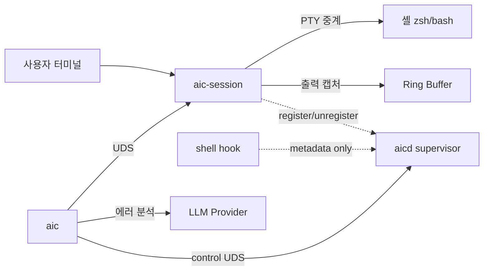

# aic

> Rust 터미널 LLM 어시스턴트: 셸 에러 분석 + bounded·sandbox read-only 진단을 실행하는 SRE chat 에이전트. OpenAI 호환·Groq·Anthropic·CLI 백엔드 지원.

[](https://github.com/x-mesh/aic/actions/workflows/ci.yml)

**Languages:** [English](./README.md) · 한국어

## Overview

명령어가 실패하면 `aic`가 그 출력을 LLM에 넘겨 원인 설명과 수정 명령어를 받아옵니다.

내부적으로는 PTY 기반 데몬(`aic-session`)이 셸을 감싸 입출력을 중계하면서 최근 출력을 Ring Buffer에 담아 둡니다. CLI 클라이언트(`aic`)는 직전 명령어의 exit code를 보고 에러 분석 또는 Interactive REPL로 분기합니다.

사용자당 하나의 supervisor daemon(`aicd`)이 세션 lifecycle/registry/cleanup을 관리하고, 출력 캡처가 부담스러운 워크플로우를 위해 metadata만 수집하는 **hook capture mode**도 있습니다 (PRD: [docs/PRD-AICD-SUPERVISOR.md](./docs/PRD-AICD-SUPERVISOR.md), [docs/PRD-HOOK-CAPTURE-MODE.md](./docs/PRD-HOOK-CAPTURE-MODE.md)).



## Features

### Core
- ✅ PTY 셸 래퍼 — 기존 워크플로우 변경 없이 출력 캡처
- ✅ 명령어 경계 감지 — OSC 133 마커 + Timing Heuristic 폴백
- ✅ 에러 자동 분석 — exit code ≠ 0이면 LLM으로 원인 분석 및 수정 제안
- ✅ Interactive REPL — exit code = 0이면 LLM과 자유 대화
- ✅ `aic chat` agent 모드 — 명시적 대화 진입점. OpenAI 호환 provider에서는 tool-calling agent로 동작하며, provider가 tool을 지원하지 않으면 일반 대화로 자연스럽게 degrade
- ✅ SRE 셸 실행 (기본 활성) — 대화형 agent가 **bounded·sandbox** 셸 명령을 `run_command`로 실행한다(`ps`/`df -h`/`grep` 같은 읽기 진단은 자동 실행, 상태 변경은 확인, 위험 명령은 차단). `--no-run`/`--read-only`/`AIC_AGENT_NO_RUN=1`로 끄면 읽기 전용 세션(`read_file`/`list_dir`/`grep`/`glob`만)
- ✅ 다중 LLM Provider — OpenAI 호환, Groq, Anthropic, CLI Backend (kiro-cli, claude-cli)
- ✅ TUI 호환 — Alternate Screen Buffer 감지로 vim, htop 등 정상 동작
- ✅ Cross-Platform — macOS (Apple Silicon, x86_64), Linux (x86_64, aarch64)

### 안정성·진단
- ✅ 단일 인스턴스 보장 — `fcntl(F_SETLK)` PID lock + stale 자동 정리
- ✅ Graceful shutdown — SIGTERM/SIGINT 핸들링, drain 후 cleanup
- ✅ 구조화 trace 로그 — JSONL daily rotate (7일 보존), `AIC_LOG=info|debug`
- ✅ `aic doctor` — 9축 환경 진단 (config/provider/소켓/데몬/supervisor/셸hook/LLM endpoint/keychain/audit)
- ✅ `aic status` — 데몬 PID/ping/마지막 명령어 1회 출력

### 보안 baseline
- ✅ Secret/PII redaction — secret 5종(AWS/GitHub/OpenAI/Anthropic/JWT) + PII 4종(email/한국 전화/주민번호/IPv4) 자동 마스킹, `AIC_REDACT=off` opt-out
- ✅ Audit log HMAC chain — `~/.local/state/aic/audit.log` JSONL append-only, `aic audit verify` 무결성 검증. HMAC 키는 **기본 file backend**, OS keychain은 opt-in(`AIC_AUDIT_KEYCHAIN=1`), `AIC_NO_KEYCHAIN=1`은 강제 off
  - **업그레이드 노트**: 이전 버전에서 audit 키가 OS keychain에만 있던 경우, 새 file 기본에서 verify WARN/키 없음(또는 chain 보호를 위한 append skip)이 날 수 있다. (1) keychain chain을 계속 검증/사용하려면 `AIC_AUDIT_KEYCHAIN=1`로 실행, **또는** (2) 새 file 기반 chain을 시작하려면 `~/.local/state/aic/audit.log`를 백업/rotate 후 재실행. `aic doctor`가 두 선택지를 안내한다.
- ✅ OS keychain — macOS Keychain / Linux Secret Service / Windows Credential Manager로 API key 저장, `aic migrate-keys`로 평문 일괄 이동

### LLM UX
- ✅ Streaming — OpenAI-compat 자동 streaming (TTY 환경), `AIC_NO_STREAM=1` opt-out
- ✅ 결과 캐시 — 같은 (cmd, exit, output) 24h TTL, 즉시 응답
- ✅ Dry-run 미리보기 — `aic --dry-run "..."`로 토큰·비용·timeout 사전 확인
- ✅ Retry circuit breaker — 60s window 5회 실패 시 30s fail-fast
- ✅ i18n 자동 감지 — `lang = "auto"` 시 `$LC_ALL`/`$LANG` 추론

### Onboarding
- ✅ `aic init zsh|bash` — 셸 hook 자동 설치 (마커 기반 멱등)
- ✅ `aic init --hook-mode` — Phase 3 metadata-only hook 추가 설치
- ✅ `aic config` 인터랙티브 wizard

### Supervisor / Capture Modes
- ✅ `aicd` supervisor daemon — 사용자당 1개. 세션 registry, control UDS,
  graceful shutdown
- ✅ `aic daemon { status | start | stop }` — supervisor 제어
- ✅ `aic session stop <id>` — registry 기반 세션 종료
- ✅ `aic sessions` — aicd registry-first, fallback to socket scan
- ✅ Hook capture mode — `~/.aic/hook-events.{zsh,bash}`로 metadata만 수집
- ✅ `aic run -- <cmd>` — explicit FullOutput capture wrapper
- ✅ `CommandRecord.capture_mode/quality` + 분석 시 capture quality hint

### Roadmap
- 🚧 `aic-proxy` — LLM API 프록시 서버 (개발 예정)
- 🚧 PTY ownership을 `aicd`로 이동 (PRD-AICD-SUPERVISOR Phase 2 본 구현)
- 🚧 `aic capture-last` — destructive command 감지 + confirm UX
- 🚧 launchd/systemd unit 자동 설치

## 동작 원리

1. `aic-session`이 사용자의 기본 셸을 PTY 자식 프로세스로 띄움
2. 셸 입출력을 중계하면서, ANSI Escape를 제거한 clean text를 Ring Buffer에 저장
3. OSC 133 마커 또는 Timing Heuristic으로 명령어 경계를 찾아 CommandRecord 생성
4. 사용자가 `aic`를 실행하면 UDS를 통해 직전 명령어 데이터를 조회
5. exit code에 따라 에러 분석(LLM) 또는 Interactive REPL로 자동 분기

## Quick Start

### Prerequisites

- Rust 1.75+ (2021 edition)
- macOS 또는 Linux
- LLM API key (OpenAI, Anthropic, Groq 등) 또는 CLI Backend (kiro-cli, claude-cli)

### 빌드 및 설치

#### 원라이너 installer (macOS / Linux)

```bash
curl -fsSL https://raw.githubusercontent.com/x-mesh/aic/main/install.sh | sh
```

OS/아키텍처(`linux`/`darwin` × `amd64`/`arm64`)를 감지해서 맞는 release
archive를 받고, `checksums.txt`로 SHA-256을 검증한 다음 `aic` +
`aic-session` + `aicd` 셋을 `/usr/local/bin`(쓰기 권한 없으면 sudo) 또는
`~/.local/bin`에 설치합니다.

옵션:

```bash
AIC_VERSION=v0.4.0 sh install.sh         # 특정 tag 고정
AIC_INSTALL_DIR=$HOME/.local/bin sh ...  # 사용자 디렉토리에 설치
```

#### Homebrew (macOS / Linux)

```bash
brew tap x-mesh/tap
brew install aic
# 자동 시작은 설치 후 한 번:
aic daemon install     # macOS launchd / Linux systemd user unit 자동 분기
```

`brew services`는 macOS launchd만 잘 붙고 Linux systemd 쪽은 좀 부실해서,
`aic daemon install`이 양 OS 모두 일관되게 처리합니다.

#### Source 빌드

```bash
git clone https://github.com/x-mesh/aic.git && cd aic
cargo build --workspace --release
cargo install --path aic-server   # aic-session + aicd 설치
cargo install --path aic-client   # aic 설치
```

또는 Makefile 사용:

```bash
make install
```

개발 / 검증:

```bash
cargo check --workspace      # 빠른 타입 체크
cargo test --workspace       # 테스트 실행 (커밋 전 필수)
make check                   # fmt + clippy + check (Makefile 참고)
```

### 셀프 업데이트

```bash
aic update             # 설치 출처를 감지해 그 자리에서 갱신
aic update --check     # 신버전이 있으면 exit 1, 최신이면 0
aic update --to v0.4.0 # 특정 tag 고정 (manual install에서만 적용)
aic update --force     # 같은 버전이어도 강제 재설치
```

`aic update`는 설치 경로를 보고 출처를 감지해 알맞은 경로로 갱신합니다:

| 설치 출처 | 동작 |
|---|---|
| Homebrew (`/opt/homebrew`, `/usr/local/Cellar`, linuxbrew) | `brew upgrade x-mesh/tap/aic`로 위임 |
| Manual / `install.sh` (`/usr/local/bin`, `~/.local/bin`) | release archive 다운 + sha256 검증 + 세 binary atomic 교체 (`/usr/local/bin`은 필요 시 sudo) |
| `cargo install` (`~/.cargo/bin`) | 자동 교체 거부, 동일 동작의 `cargo install` 명령 안내 |

디스크의 binary를 교체한 뒤 새 버전을 적용하려면 `aicd`를 재시작하세요:
`aic daemon restart`.

### 설정

```bash
mkdir -p ~/.config/aic
cp <<'EOF' > ~/.config/aic/config.toml
[server]
max_buffer_lines = 500

[server.boundary_strategy]
method = "prompt_marker"

[llm]
default_provider = "openai"

[llm.providers.openai]
provider_type = "OpenAiCompatible"
endpoint = "https://api.openai.com/v1/chat/completions"
api_key = "sk-..."
model = "gpt-4o"
EOF
```

### 사용

```bash
# 1. 첫 셋업 — config + 셸 hook 자동 설치
aic config             # provider/api_key/model 인터랙티브 설정
aic init zsh           # ~/.zshrc에 'source ~/.aic/hooks.zsh' 멱등 추가
aic migrate-keys       # 평문 API key를 OS keychain으로 이동 (선택)
aic doctor             # 9축 진단 — PASS/WARN/FAIL 한눈에 확인
aic doctor --probe-tools  # opt-in 라이브 probe: provider가 실제로 tool-calling을 지원하는지 진단

# 2. (선택) supervisor 시작 — 멀티 세션 lifecycle 중앙 관리
aic daemon start       # aicd 백그라운드 spawn
aic daemon status      # 떠 있는지 + 등록 세션 수 확인

# 3. aic-session으로 셸 시작 — aicd가 떠 있으면 자동 register
aic-session

# 4. 평소처럼 명령어 실행
cargo build   # 에러 발생!

# 5. aic로 에러 분석
aic
# → LLM이 에러 원인을 설명하고 수정 명령어를 제안 (TTY는 자동 streaming)

# 6. 에러가 없을 때 aic 실행하면 REPL 모드
aic
# → LLM과 자유 대화 (exit/quit/Ctrl+D로 종료)

# 7. 직접 질문 + dry-run으로 비용 미리보기
aic --dry-run "이 에러 어떻게 해결해?"

# 8. 명시적 chat / agent 모드 (exit code와 무관)
aic chat "이 저장소가 뭐 하는지 요약해줘"   # 1회 답변 후 종료
aic chat                                      # 대화형 SRE agent (run_command 기본 활성)
# → OpenAI 호환 provider면 도구(read_file/list_dir/grep/glob)로 프로젝트를 읽는다.
#   접근은 cwd sandbox로 제한되고 .gitignore를 존중한다. 또한 BOUNDED 셸 명령을
#   run_command로 실행할 수 있다. 대화창에 다음처럼 입력:
#     ps        → `ps aux | head -n 20` 실행
#     disk      → `df -h` 실행
#     cpu/memory/net → OS에 맞는 bounded 명령
# → Safe 읽기 명령은 자동, 상태 변경은 TTY 확인, 위험/불명은 차단. 셸은 제한됨
#   ($·glob·따옴표·redirect·;·& 등 차단).
aic chat --no-run                             # 읽기 전용 세션(run_command 끔); --read-only 동의어
AIC_AGENT_NO_RUN=1 aic chat                   # env로 동일 opt-out
AIC_DEBUG=1 aic chat                          # stderr 디버그: tool_specs/run_command/provider_tools (banner는 계속 표시)
NO_COLOR=1 aic chat                           # plain 출력(ANSI 없음; non-TTY에서도 자동)
# → 시작 시 banner + status line(mode/tools/policy/cwd/provider)이 stderr로 출력된다.
#   채팅 프롬프트는 TTY면 "◇ you ❯ ", 파이프면 plain "you> ". LLM 답변은 stdout,
#   banner/status/command card/debug는 stderr로 분리(파이프 안전).
# → 세션 내 slash 명령은 로컬에서 가로채 처리하며 LLM에 전송되지 않는다:
#   /local /diagnose /explain-last /incident /doctor /timeline /compare /bundle /triage /watch /help.
#   TTY에서 "/"를 입력하면 후보 패널이 열린다. 자세한 표는 아래 "Chat slash 명령" 참고.
# (레거시 --sre / --allow-run은 파싱은 되지만 이제 no-op: run_command가 기본 활성)
# 설계 문서: docs/PRD-AIC-SRE-CHAT.md · docs/RFC-002-AIC-CHAT-AGENTIC.md
# → 비용 미리보기: aic chat --dry-run "ping"

# 9. 운영
aic status             # 데몬 PID/ping/마지막 명령어
aic sessions           # 모든 활성 세션 (aicd registry-first)
aic session stop <id>  # 특정 세션 종료 (aicd 필요)
aic audit verify       # audit log HMAC chain 무결성 (exit 0/2/3)
```

### Chat slash 명령

`aic chat` 안에서 `/`로 시작하는 줄은 로컬에서 가로채 처리한다 — **LLM에 전송되지 않고** 대화 history에도
들어가지 않으며, 출력은 화면(stderr)에만 표시된다. TTY에서는 `/`를 입력하면 후보 패널이 열린다(↑↓ 이동,
Tab 순환, Enter 선택, Esc 닫기).

| 명령 | 설명 |
|------|------|
| `/help` | 사용 가능한 slash 명령 목록 |
| `/last [N]` | 직전 tool 카드, 또는 최근 N개 tool 호출 요약 |
| `/raw [seq\|corr]` | 마지막(또는 지정) tool 호출의 redacted 전체 출력 |
| `/local [section] [--raw]` | 로컬 sysinfo 스냅샷 → LLM 요약 (`--raw`=증거만). alias: `/sys`, `/snapshot` |
| `/diagnose [--raw] <증상>` | 증상에서 Safe probe 선택·수집 후 분석 → 가설 / 증거 인용 / 다음 안전 확인 |
| `/explain-last [--raw] [seq\|corr]` | 마지막(또는 지정) tool 기록 분석: 원인 후보 / 증거 / 다음 확인 |
| `/incident [--raw] [name]` | 시스템 스냅샷 + git read-only 증거(repo) + 최근 기록을 묶어 분석. `name`은 라벨 전용 |
| `/doctor` | AIC 자체 상태: provider/model, tool-calling 지원, run_command on/off, env flag는 set/unset만(secret 값 없음) |
| `/timeline [N]` | 세션 tool 기록 시간순(redacted) |
| `/compare` | 고정 Safe 시스템 스냅샷을 직전 baseline과 diff(LLM 미호출) |
| `/bundle [name]` | 인시던트 증거를 redacted markdown으로 `~/.aic/bundles/`에 저장(dir 0700 / file 0600, Unix) |
| `/triage [--run] [topic]` | 토픽 체크리스트 + Probe Catalog 후보 probe; `--run`이면 실행(LLM 미호출). topics: `mac-slow web disk memory cpu network build-fail generic` |
| `/watch [target] [--count N] [--every Ns]` | 로컬 probe를 몇 번 다시 실행해 tick마다 변화량을 요약(LLM 미호출). bounded: 기본 3회(최대 20), 간격 1s. `target`은 섹션 이름, 생략하면 compact 세트 |

probe는 고정·bounded·read-only Safe 명령의 단일 **Probe Catalog**(`agent::probes`)에서 온다(local
sysinfo 섹션 + `process` + git read-only). `/local`·`/compare`·`/diagnose`·`/incident`·`/bundle`·
`/triage`가 모두 이를 참조한다.

분석 명령은 **redacted** 증거 스냅샷을 tool 없는 stateless 단발 호출로 provider에 보낸다. `--raw`(및
`AIC_LOCAL_NO_ANALYZE=1`)는 모델 호출을 건너뛰고 증거만 보여주며, provider 오류/timeout 시 raw 증거로
fallback한다. 분석 출력은 TTY에서 CLI 친화 markdown subset(amber 강조)으로 렌더되고, 파이프에서는 plain,
진행 중에는 spinner를 표시한다.

보류(roadmap): `/runbook`, `/fix-preview`, `/config`, background watch daemon, persistent `/audit` 조회.

### 안전 모델 (run_command)

`aic chat`은 모든 셸 명령을 실행 전에 분류하며, 가드는 약화하지 않는다:

| Tier | 동작 | 예시 |
|------|------|------|
| **Safe** | 자동 실행 | `ps aux`, `df -h`, `cat`, `grep`, `dig name` |
| **NeedsConfirm** | TTY 확인(비대화형은 거부) | `systemctl restart`, `git commit`, `curl https://…`(네트워크 egress) |
| **Dangerous** | 차단 | `rm -rf`, `mkfs`, `dd`, `ssh`/`scp`/`nc`(원격/임의 네트워크) |
| **Unknown** | 차단(보수적) | 파싱 불가 / subshell `$(…)` |

추가 보장: 명령은 cwd 샌드박스 + 최소 env allowlist(API key 미전달)로 `sh -c` 실행되고, 출력 bounded +
process-group timeout이 걸리며, **secret/PII redaction**이 LLM·화면·audit log에 닿기 전에 적용된다. 셸 실행
자체를 끄려면 `--no-run` / `--read-only` / `AIC_AGENT_NO_RUN=1`(읽기 도구 `read_file`/`list_dir`/`grep`/
`glob`는 유지).

### 옵션: Hook capture mode (PTY wrapper 없이 metadata만)

PTY 래핑 부담 없이 명령어 metadata만 수집하고 싶을 때:

```bash
aic daemon start                    # aicd 필수 (hook 이벤트 수신)
aic init zsh --hook-mode            # ~/.aic/hook-events.zsh 설치
exec zsh                            # 새 셸 → preexec/precmd hook 활성

# 평소처럼 명령어 실행 — aic-session 없어도 metadata 누적
ls -la
cargo build

# 정확한 출력이 필요할 때만 explicit capture
aic run -- cargo build              # stdout/stderr 보존, exit code 그대로
```

### 환경 변수

| 변수 | 효과 |
|---|---|
| `AIC_LOG=info|debug|trace` | aic-session/aicd tracing 레벨 (기본 info) |
| `AIC_REDACT=off` | secret/PII redaction 비활성 (audit 기록됨) |
| `AIC_NO_STREAM=1` | streaming 비활성 (spinner + sectional 출력) |
| `AIC_DEBUG=1` | client `[debug +X.XXXs]` prefix 출력 |
| `AIC_AUDIT_KEYCHAIN=1` | audit HMAC 키를 OS keychain에 저장(opt-in). **기본은 file 키** |
| `AIC_NO_KEYCHAIN=1` | keychain을 강제 off(최우선) — opt-in보다 우선, 항상 file 키 |
| `AIC_LOCAL_NO_ANALYZE=1` | `/local`·`/diagnose` 등 분석을 끄고 raw 증거만 |
| `AIC_NO_BANNER=1` / `AIC_QUIET=1` | `aic chat` 시작 배너·status 줄·context header 출력 안 함 (이 chrome은 debug 출력과 무관) |
| `AIC_VERBOSE=1` | command별 상세 `run_command` 카드(preamble + `→ done` 요약) 표시. 기본은 조용(섹션 헤더 + 보안 경고만). `AIC_DEBUG=1`도 활성화 |
| `AIC_SESSION_ID` | 활성 세션 ID. `aic-session`이 자동 export, hook도 참조 |

## Project Structure

```
aic/
├── aic-common/                      # 공유 데이터 모델, IPC 프로토콜, 에러
│   └── src/
│       ├── lib.rs                   # CommandRecord (+ capture_mode/quality),
│       │                            # SessionInfo/SessionState, SessionConfig,
│       │                            # AppConfig, capture_quality_hint()
│       ├── ipc.rs                   # IpcRequest/Response — session/control/hook
│       ├── error.rs                 # AicError
│       └── paths.rs                 # session_socket_path, aicd_socket_path,
│                                    # aicd_lock_path
├── aic-server/                      # 두 binary: aic-session + aicd
│   └── src/
│       ├── main.rs                  # aic-session: PTY wrapper + register/
│       │                            # unregister to aicd
│       ├── aicd_main.rs             # aicd: singleton + control UDS + signal
│       ├── control_server.rs        # aicd control plane (RingBuffer-free)
│       ├── session_registry.rs      # in-memory HashMap registry
│       ├── hook_events.rs           # per-session bounded ring (Phase 3)
│       ├── aicd_client.rs           # aic-session → aicd best-effort RPC
│       ├── pty_manager.rs / output_processor.rs / boundary_detector.rs /
│       │   ring_buffer.rs / uds_server.rs / lock.rs / metrics.rs / telemetry.rs
├── aic-client/                      # CLI 클라이언트 (바이너리: aic)
│   └── src/
│       ├── main.rs                  # clap CLI: 11+ subcommand
│       ├── hook_install.rs          # zsh/bash hook script generator (Phase 3)
│       ├── uds_client.rs            # session UDS + aicd control client
│       ├── doctor.rs                # 9축 진단 (aicd supervisor 포함)
│       ├── config.rs / auto_brancher.rs / error_analyzer.rs /
│       │   llm_dispatcher.rs / repl.rs / cache.rs / redaction.rs /
│       │   audit.rs / keychain.rs / streaming.rs / spinner.rs / top.rs
├── docs/                            # PRD, capture mode trade-off
├── Cargo.toml                       # Workspace 정의
└── Makefile
```

## 설정 파일

설정 파일 경로: `~/.config/aic/config.toml` (XDG Base Directory 준수)

```toml
[server]
max_buffer_lines = 500
# socket_path = "/custom/path/session.sock"  # 선택: 소켓 경로 직접 지정

[server.boundary_strategy]
method = "prompt_marker"           # "prompt_marker" 또는 "timing_heuristic"
# idle_threshold_ms = 500          # timing_heuristic 사용 시 idle 임계값

[llm]
default_provider = "openai"        # 기본 Provider 이름

# ── OpenAI 호환 (OpenAI, NVIDIA 등) ──
[llm.providers.openai]
provider_type = "OpenAiCompatible"
endpoint = "https://api.openai.com/v1/chat/completions"
api_key = "sk-..."
model = "gpt-4o"

[llm.providers.nvidia]
provider_type = "OpenAiCompatible"
endpoint = "https://integrate.api.nvidia.com/v1/chat/completions"
api_key = "nvapi-..."
model = "meta/llama-3.1-70b-instruct"

# ── Groq (OpenAI 호환 — endpoint/model 미지정 시 Groq 기본값 자동 적용) ──
[llm.providers.groq]
provider_type = "Groq"
api_key = "gsk_..."
model = "llama-3.3-70b-versatile"
# endpoint 생략 시 https://api.groq.com/openai/v1/chat/completions 사용
# 다른 모델: llama-3.1-8b-instant · deepseek-r1-distill-llama-70b · gemma2-9b-it

# ── Anthropic ──
# 모델 ID는 https://docs.anthropic.com/en/docs/about-claude/models 참조.
# 권장: claude-opus-4-7 (최강), claude-sonnet-4-6 (균형, 기본값),
#       claude-haiku-4-5-20251001 (저렴/빠름).
# 옛 모델(claude-sonnet-4-20250514, claude-3-5-haiku-20241022 등)은 retire 시
# 404로 응답할 수 있으니 위 ID로 갱신하세요.
[llm.providers.anthropic]
provider_type = "Anthropic"
endpoint = "https://api.anthropic.com/v1/messages"
api_key = "sk-ant-..."
model = "claude-sonnet-4-6"

# ── CLI Backend (로컬 CLI 도구) ──
[llm.providers.kiro-cli]
provider_type = "CliBackend"
cli_path = "kiro"

[llm.providers.claude-cli]
provider_type = "CliBackend"
cli_path = "claude"
```

## Environment Variables

| 변수 | 설명 | 기본값 |
|------|------|--------|
| `XDG_CONFIG_HOME` | 설정 파일 디렉토리 | `~/.config` |
| `XDG_RUNTIME_DIR` | 소켓 경로 (Linux) | `/tmp/aic-{uid}` |
| `AIC_SESSION_ID` | 활성 세션 식별자 — `aic-session`이 셸에 export. 클라이언트(`aic`/`status`/`doctor`/`top`)가 이 값으로 sock을 찾는다. | (자동 생성) |
| `AIC_NO_RUN` | 설정 시 LLM 제안 명령 인라인 실행 prompt 비활성화 | unset |
| `AIC_AUTO_RUN` | `1`이면 인라인 실행 prompt 없이 자동 실행 (destructive 명령 제외) | unset |
| `AIC_DEBUG` | `1` 또는 `true`면 `[debug +X.XXXs]` 로그 stderr 출력 (agent loop는 `provider_tools=…`/`tool_specs=…` structured 라인 추가, banner는 계속 표시) | unset |
| `AIC_AGENT_NO_RUN` | `1` 또는 `true`면 `aic chat`을 읽기 전용으로(`run_command` 끔; `--no-run`/`--read-only`와 동일) | unset |
| `NO_COLOR` | 설정 시 `aic chat` banner/status/card/debug의 ANSI 색상 억제 (non-TTY stderr에서도 자동 억제) | unset |
| `AIC_REDACT` | `1`이면 LLM 송신 직전 prompt에서 secret/PII 마스킹 | unset |
| `AIC_NO_STREAM` | 설정 시 streaming 응답 비활성화 (한 번에 받아 표시) | unset |

## 소켓 경로 (멀티세션)

`aic-session`을 여러 터미널에서 실행하면 각각 독립된 소켓이 생긴다.

| 플랫폼 | 경로 패턴 |
|--------|-----------|
| macOS | `/tmp/aic-{uid}/session-{id}.sock` |
| Linux (XDG 설정) | `$XDG_RUNTIME_DIR/aic/session-{id}.sock` |
| Linux (XDG 미설정) | `/tmp/aic-{uid}/session-{id}.sock` |

`{id}`는 `aic-session`이 자동 생성하는 16-hex 식별자(`AIC_SESSION_ID` env로 export됨).

### 클라이언트의 세션 결정 우선순위
`aic status` / `aic doctor` / `aic top` 등이 어떤 세션을 보는지:

1. `--session <id>` (명시적 인자)
2. `$AIC_SESSION_ID` (셸 export — 보통 자동)
3. `config.server.socket_path` (사용자 override)
4. `session-*.sock` 중 mtime 최신 (활성 세션 자동 선택)
5. legacy `session.sock` (구버전 호환)

`aic sessions` 또는 `aic status --all`로 전체 목록 확인.

## IPC 프로토콜

서버-클라이언트 간 JSON-over-UDS 통신. Length-prefixed framing 사용:

```
[4 bytes: payload length (u32 big-endian)][JSON payload]
```

세션 데몬 (`aic-session`) 소켓:

| Request | 설명 |
|---------|------|
| `GetLastCommand` | 직전 명령어의 CommandRecord 조회 |
| `GetRecentLines { count }` | 최근 N 라인 텍스트 조회 |
| `Ping` / `GetMetrics` | health / metrics |

Supervisor (`aicd`) control 소켓:

| Request | 설명 |
|---------|------|
| `Ping` | aicd health |
| `ListSessions` | registry의 모든 SessionInfo |
| `RegisterSession(SessionInfo)` | 세션 등록 (aic-session이 호출) |
| `UnregisterSession { id }` | 세션 해제 |
| `StopSession { id }` | registry PID에 SIGTERM |
| `Shutdown` | aicd graceful 종료 |
| `CommandStarted/Finished` | shell hook이 보내는 metadata 이벤트 |

잘못된 소켓에 보내면 graceful `Error` 응답 ("aicd 소켓에 연결하세요").

## 개발 가이드

### 빌드

```bash
make              # debug 빌드
make release      # release 빌드 (최적화)
make check        # 빠른 컴파일 체크
```

### 테스트

```bash
make test         # 전체 테스트
make test-unit    # 유닛 테스트만
make e2e          # E2E 테스트만
make test-prop    # Property-Based 테스트 (1024 cases)
make test-pty     # PTY 통합 테스트 (터미널 필요)
```

### 린트

```bash
make lint         # clippy + fmt check
make fix          # 자동 수정
```

### 실행 (개발 모드)

```bash
make run-server   # aic-session 실행
make run-client   # aic 실행
make run-config   # aic config 실행
```

### 기타

```bash
make ci           # CI 로컬 재현 (lint + test)
make doc          # rustdoc 생성 및 열기
make loc          # 코드 라인 수 통계
make deps         # 의존성 트리
make help         # 전체 명령어 목록
```

## 기술 스택

| 영역 | 기술 |
|------|------|
| 언어 | Rust (2021 edition) |
| PTY 관리 | `portable-pty` |
| Async Runtime | `tokio` |
| HTTP Client | `reqwest` (rustls) |
| IPC | Unix Domain Socket (`tokio::net::UnixListener`) |
| Serialization | `serde` + `serde_json` / `toml` |
| CLI Parsing | `clap` |
| ANSI 제거 | `strip-ansi-escapes` |
| 테스트 | `proptest` (Property-Based Testing) |

## License

MIT (LICENSE 파일 미동봉)
