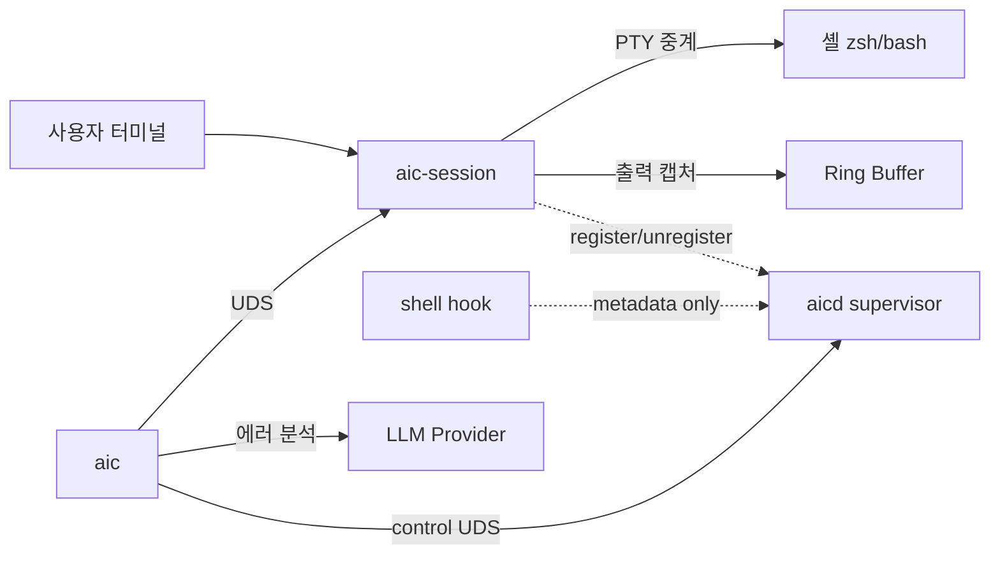

# aic

> 셸 명령어 에러를 자동으로 분석하고 수정 명령어를 제안하는 지능형 CLI 도우미

[](https://github.com/user/aic/actions/workflows/ci.yml)

## Overview

`aic`는 터미널에서 명령어 실행 중 발생하는 에러를 LLM으로 분석하여 원인을 설명하고 수정 명령어를 제안하는 도구입니다.

PTY 기반 셸 래퍼 데몬(`aic-session`)이 사용자의 셸을 투명하게 감싸서 입출력을 중계하면서 출력을 캡처하고, CLI 클라이언트(`aic`)가 직전 명령어의 exit code에 따라 자동으로 에러 분석 또는 Interactive REPL 모드로 분기합니다.

추가로, 사용자당 하나의 supervisor daemon(`aicd`)이 세션 lifecycle/registry/cleanup을 중앙 관리하고, 출력 캡처가 부담스러운 워크플로우를 위한 metadata-only **hook capture mode**도 제공합니다 (PRD: [docs/PRD-AICD-SUPERVISOR.md](./docs/PRD-AICD-SUPERVISOR.md), [docs/PRD-HOOK-CAPTURE-MODE.md](./docs/PRD-HOOK-CAPTURE-MODE.md)).



## Features

### Core
- ✅ PTY 셸 래퍼 — 기존 워크플로우 변경 없이 투명하게 출력 캡처
- ✅ 명령어 경계 감지 — OSC 133 마커 + Timing Heuristic 폴백
- ✅ 에러 자동 분석 — exit code ≠ 0이면 LLM으로 원인 분석 및 수정 제안
- ✅ Interactive REPL — exit code = 0이면 LLM과 자유 대화
- ✅ 다중 LLM Provider — OpenAI 호환, Anthropic, CLI Backend (kiro-cli, claude-cli)
- ✅ TUI 호환 — Alternate Screen Buffer 감지로 vim, htop 등 정상 동작
- ✅ Cross-Platform — macOS (Apple Silicon, x86_64), Linux (x86_64, aarch64)

### 안정성·진단
- ✅ 단일 인스턴스 보장 — `fcntl(F_SETLK)` PID lock + stale 자동 정리
- ✅ Graceful shutdown — SIGTERM/SIGINT 핸들링, drain 후 cleanup
- ✅ 구조화 trace 로그 — JSONL daily rotate (7일 보존), `AIC_LOG=info|debug`
- ✅ `aic doctor` — 8축 환경 진단 (config/데몬/셸hook/LLM endpoint/keychain/audit)
- ✅ `aic status` — 데몬 PID/ping/마지막 명령어 1회 출력

### 보안 baseline
- ✅ Secret/PII redaction — secret 5종(AWS/GitHub/OpenAI/Anthropic/JWT) + PII 4종(email/한국 전화/주민번호/IPv4) 자동 마스킹, `AIC_REDACT=off` opt-out
- ✅ Audit log HMAC chain — `~/.local/state/aic/audit.log` JSONL append-only, `aic audit verify` 무결성 검증
- ✅ OS keychain — macOS Keychain / Linux Secret Service / Windows Credential Manager로 API key 저장, `aic migrate-keys`로 평문 일괄 이동

### LLM UX
- ✅ Streaming — OpenAI-compat 자동 streaming (TTY 환경), `AIC_NO_STREAM=1` opt-out
- ✅ 결과 캐시 — 같은 (cmd, exit, output) 24h TTL, 즉시 응답
- ✅ Dry-run 미리보기 — `aic --dry-run "..."`로 토큰·비용·timeout 사전 확인
- ✅ Retry circuit breaker — 60s window 5회 실패 시 30s fail-fast
- ✅ i18n 자동 감지 — `lang = "auto"` 시 `$LC_ALL`/`$LANG` 추론

### Onboarding
- ✅ `aic init zsh|bash` — 셸 hook 자동 설치 (마커 기반 멱등)
- ✅ `aic init --hook-mode` — Phase 3 metadata-only hook 추가 설치
- ✅ `aic config` 인터랙티브 wizard

### Supervisor / Capture Modes (신규)
- ✅ `aicd` supervisor daemon — 사용자당 1개. 세션 registry, control UDS,
  graceful shutdown
- ✅ `aic daemon { status | start | stop }` — supervisor 제어
- ✅ `aic session stop <id>` — registry 기반 세션 종료
- ✅ `aic sessions` — aicd registry-first, fallback to socket scan
- ✅ Hook capture mode — `~/.aic/hook-events.{zsh,bash}`로 metadata만 수집
- ✅ `aic run -- <cmd>` — explicit FullOutput capture wrapper
- ✅ `CommandRecord.capture_mode/quality` + 분석 시 capture quality hint

### Roadmap
- 🚧 `aic-proxy` — LLM API 프록시 서버 (개발 예정)
- 🚧 PTY ownership을 `aicd`로 이동 (PRD-AICD-SUPERVISOR Phase 2 본 구현)
- 🚧 `aic capture-last` — destructive command 감지 + confirm UX
- 🚧 launchd/systemd unit 자동 설치

## 동작 원리

1. `aic-session`이 사용자의 기본 셸을 PTY 자식 프로세스로 실행
2. 셸 입출력을 투명하게 중계하면서, ANSI Escape를 제거한 clean text를 Ring Buffer에 저장
3. OSC 133 마커 또는 Timing Heuristic으로 명령어 경계를 식별하여 CommandRecord 생성
4. 사용자가 `aic`를 실행하면 UDS를 통해 직전 명령어 데이터를 조회
5. exit code에 따라 에러 분석(LLM) 또는 Interactive REPL로 자동 분기

## Quick Start

### Prerequisites

- Rust 1.75+ (2021 edition)
- macOS 또는 Linux
- LLM API key (OpenAI, Anthropic 등) 또는 CLI Backend (kiro-cli, claude-cli)

### 빌드 및 설치

```bash
git clone https://github.com/user/aic.git && cd aic
cargo build --workspace --release
cargo install --path aic-server   # aic-session 설치
cargo install --path aic-client   # aic 설치
```

또는 Makefile 사용:

```bash
make install
```

### 설정

```bash
mkdir -p ~/.config/aic
cp <<'EOF' > ~/.config/aic/config.toml
[server]
max_buffer_lines = 500

[server.boundary_strategy]
method = "prompt_marker"

[llm]
default_provider = "openai"

[llm.providers.openai]
provider_type = "OpenAiCompatible"
endpoint = "https://api.openai.com/v1/chat/completions"
api_key = "sk-..."
model = "gpt-4o"
EOF
```

### 사용

```bash
# 1. 첫 셋업 — config + 셸 hook 자동 설치
aic config             # provider/api_key/model 인터랙티브 설정
aic init zsh           # ~/.zshrc에 'source ~/.aic/hooks.zsh' 멱등 추가
aic migrate-keys       # 평문 API key를 OS keychain으로 이동 (선택)
aic doctor             # 9축 진단 — PASS/WARN/FAIL 한눈에 확인

# 2. (선택) supervisor 시작 — 멀티 세션 lifecycle 중앙 관리
aic daemon start       # aicd 백그라운드 spawn
aic daemon status      # 떠 있는지 + 등록 세션 수 확인

# 3. aic-session으로 셸 시작 — aicd가 떠 있으면 자동 register
aic-session

# 4. 평소처럼 명령어 실행
cargo build   # 에러 발생!

# 5. aic로 에러 분석
aic
# → LLM이 에러 원인을 설명하고 수정 명령어를 제안 (TTY는 자동 streaming)

# 6. 에러가 없을 때 aic 실행하면 REPL 모드
aic
# → LLM과 자유 대화 (exit/quit/Ctrl+D로 종료)

# 7. 직접 질문 + dry-run으로 비용 미리보기
aic --dry-run "이 에러 어떻게 해결해?"

# 8. 운영
aic status             # 데몬 PID/ping/마지막 명령어
aic sessions           # 모든 활성 세션 (aicd registry-first)
aic session stop <id>  # 특정 세션 종료 (aicd 필요)
aic audit verify       # audit log HMAC chain 무결성 (exit 0/2/3)
```

### 옵션: Hook capture mode (PTY wrapper 없이 metadata만)

PTY 래핑 부담 없이 명령어 metadata만 수집하고 싶을 때:

```bash
aic daemon start                    # aicd 필수 (hook 이벤트 수신)
aic init zsh --hook-mode            # ~/.aic/hook-events.zsh 설치
exec zsh                            # 새 셸 → preexec/precmd hook 활성

# 평소처럼 명령어 실행 — aic-session 없어도 metadata 누적
ls -la
cargo build

# 정확한 출력이 필요할 때만 explicit capture
aic run -- cargo build              # stdout/stderr 보존, exit code 그대로
```

### 환경 변수

| 변수 | 효과 |
|---|---|
| `AIC_LOG=info|debug|trace` | aic-session/aicd tracing 레벨 (기본 info) |
| `AIC_REDACT=off` | secret/PII redaction 비활성 (audit 기록됨) |
| `AIC_NO_STREAM=1` | streaming 비활성 (spinner + sectional 출력) |
| `AIC_DEBUG=1` | client `[debug +X.XXXs]` prefix 출력 |
| `AIC_SESSION_ID` | 활성 세션 ID. `aic-session`이 자동 export, hook도 참조 |

## Project Structure

```
aic/
├── aic-common/                      # 공유 데이터 모델, IPC 프로토콜, 에러
│   └── src/
│       ├── lib.rs                   # CommandRecord (+ capture_mode/quality),
│       │                            # SessionInfo/SessionState, SessionConfig,
│       │                            # AppConfig, capture_quality_hint()
│       ├── ipc.rs                   # IpcRequest/Response — session/control/hook
│       ├── error.rs                 # AicError
│       └── paths.rs                 # session_socket_path, aicd_socket_path,
│                                    # aicd_lock_path
├── aic-server/                      # 두 binary: aic-session + aicd
│   └── src/
│       ├── main.rs                  # aic-session: PTY wrapper + register/
│       │                            # unregister to aicd
│       ├── aicd_main.rs             # aicd: singleton + control UDS + signal
│       ├── control_server.rs        # aicd control plane (RingBuffer-free)
│       ├── session_registry.rs      # in-memory HashMap registry
│       ├── hook_events.rs           # per-session bounded ring (Phase 3)
│       ├── aicd_client.rs           # aic-session → aicd best-effort RPC
│       ├── pty_manager.rs / output_processor.rs / boundary_detector.rs /
│       │   ring_buffer.rs / uds_server.rs / lock.rs / metrics.rs / telemetry.rs
├── aic-client/                      # CLI 클라이언트 (바이너리: aic)
│   └── src/
│       ├── main.rs                  # clap CLI: 11+ subcommand
│       ├── hook_install.rs          # zsh/bash hook script generator (Phase 3)
│       ├── uds_client.rs            # session UDS + aicd control client
│       ├── doctor.rs                # 9축 진단 (aicd supervisor 포함)
│       ├── config.rs / auto_brancher.rs / error_analyzer.rs /
│       │   llm_dispatcher.rs / repl.rs / cache.rs / redaction.rs /
│       │   audit.rs / keychain.rs / streaming.rs / spinner.rs / top.rs
├── docs/                            # PRD, capture mode trade-off
├── Cargo.toml                       # Workspace 정의
└── Makefile
```

## 설정 파일

설정 파일 경로: `~/.config/aic/config.toml` (XDG Base Directory 준수)

```toml
[server]
max_buffer_lines = 500
# socket_path = "/custom/path/session.sock"  # 선택: 소켓 경로 직접 지정

[server.boundary_strategy]
method = "prompt_marker"           # "prompt_marker" 또는 "timing_heuristic"
# idle_threshold_ms = 500          # timing_heuristic 사용 시 idle 임계값

[llm]
default_provider = "openai"        # 기본 Provider 이름

# ── OpenAI 호환 (OpenAI, NVIDIA 등) ──
[llm.providers.openai]
provider_type = "OpenAiCompatible"
endpoint = "https://api.openai.com/v1/chat/completions"
api_key = "sk-..."
model = "gpt-4o"

[llm.providers.nvidia]
provider_type = "OpenAiCompatible"
endpoint = "https://integrate.api.nvidia.com/v1/chat/completions"
api_key = "nvapi-..."
model = "meta/llama-3.1-70b-instruct"

# ── Anthropic ──
[llm.providers.anthropic]
provider_type = "Anthropic"
endpoint = "https://api.anthropic.com/v1/messages"
api_key = "sk-ant-..."
model = "claude-sonnet-4-20250514"

# ── CLI Backend (로컬 CLI 도구) ──
[llm.providers.kiro-cli]
provider_type = "CliBackend"
cli_path = "kiro"

[llm.providers.claude-cli]
provider_type = "CliBackend"
cli_path = "claude"
```

## Environment Variables

| 변수 | 설명 | 기본값 |
|------|------|--------|
| `XDG_CONFIG_HOME` | 설정 파일 디렉토리 | `~/.config` |
| `XDG_RUNTIME_DIR` | 소켓 경로 (Linux) | `/tmp/aic-{uid}` |
| `AIC_SESSION_ID` | 활성 세션 식별자 — `aic-session`이 셸에 export. 클라이언트(`aic`/`status`/`doctor`/`top`)가 이 값으로 sock을 찾는다. | (자동 생성) |
| `AIC_NO_RUN` | 설정 시 LLM 제안 명령 인라인 실행 prompt 비활성화 | unset |
| `AIC_AUTO_RUN` | `1`이면 인라인 실행 prompt 없이 자동 실행 (destructive 명령 제외) | unset |
| `AIC_DEBUG` | `1` 또는 `true`면 디버그 로그 stderr 출력 | unset |
| `AIC_REDACT` | `1`이면 LLM 송신 직전 prompt에서 secret/PII 마스킹 | unset |
| `AIC_NO_STREAM` | 설정 시 streaming 응답 비활성화 (한 번에 받아 표시) | unset |

## 소켓 경로 (멀티세션)

`aic-session`을 여러 터미널에서 실행하면 각각 독립된 소켓을 만든다.

| 플랫폼 | 경로 패턴 |
|--------|-----------|
| macOS | `/tmp/aic-{uid}/session-{id}.sock` |
| Linux (XDG 설정) | `$XDG_RUNTIME_DIR/aic/session-{id}.sock` |
| Linux (XDG 미설정) | `/tmp/aic-{uid}/session-{id}.sock` |

`{id}`는 `aic-session`이 자동 생성하는 16-hex 식별자(`AIC_SESSION_ID` env로 export됨).

### 클라이언트의 세션 결정 우선순위
`aic status` / `aic doctor` / `aic top` 등이 어떤 세션을 보는지:

1. `--session <id>` (명시적 인자)
2. `$AIC_SESSION_ID` (셸 export — 보통 자동)
3. `config.server.socket_path` (사용자 override)
4. `session-*.sock` 중 mtime 최신 (활성 세션 자동 선택)
5. legacy `session.sock` (구버전 호환)

`aic sessions` 또는 `aic status --all`로 전체 목록 확인.

## IPC 프로토콜

서버-클라이언트 간 JSON-over-UDS 통신. Length-prefixed framing 사용:

```
[4 bytes: payload length (u32 big-endian)][JSON payload]
```

세션 데몬 (`aic-session`) 소켓:

| Request | 설명 |
|---------|------|
| `GetLastCommand` | 직전 명령어의 CommandRecord 조회 |
| `GetRecentLines { count }` | 최근 N 라인 텍스트 조회 |
| `Ping` / `GetMetrics` | health / metrics |

Supervisor (`aicd`) control 소켓:

| Request | 설명 |
|---------|------|
| `Ping` | aicd health |
| `ListSessions` | registry의 모든 SessionInfo |
| `RegisterSession(SessionInfo)` | 세션 등록 (aic-session이 호출) |
| `UnregisterSession { id }` | 세션 해제 |
| `StopSession { id }` | registry PID에 SIGTERM |
| `Shutdown` | aicd graceful 종료 |
| `CommandStarted/Finished` | shell hook이 보내는 metadata 이벤트 |

잘못된 소켓에 보내면 graceful `Error` 응답 ("aicd 소켓에 연결하세요").

## 개발 가이드

### 빌드

```bash
make              # debug 빌드
make release      # release 빌드 (최적화)
make check        # 빠른 컴파일 체크
```

### 테스트

```bash
make test         # 전체 테스트
make test-unit    # 유닛 테스트만
make e2e          # E2E 테스트만
make test-prop    # Property-Based 테스트 (1024 cases)
make test-pty     # PTY 통합 테스트 (터미널 필요)
```

### 린트

```bash
make lint         # clippy + fmt check
make fix          # 자동 수정
```

### 실행 (개발 모드)

```bash
make run-server   # aic-session 실행
make run-client   # aic 실행
make run-config   # aic config 실행
```

### 기타

```bash
make ci           # CI 로컬 재현 (lint + test)
make doc          # rustdoc 생성 및 열기
make loc          # 코드 라인 수 통계
make deps         # 의존성 트리
make help         # 전체 명령어 목록
```

## 기술 스택

| 영역 | 기술 |
|------|------|
| 언어 | Rust (2021 edition) |
| PTY 관리 | `portable-pty` |
| Async Runtime | `tokio` |
| HTTP Client | `reqwest` (rustls) |
| IPC | Unix Domain Socket (`tokio::net::UnixListener`) |
| Serialization | `serde` + `serde_json` / `toml` |
| CLI Parsing | `clap` |
| ANSI 제거 | `strip-ansi-escapes` |
| 테스트 | `proptest` (Property-Based Testing) |

## License

[MIT](./LICENSE)
