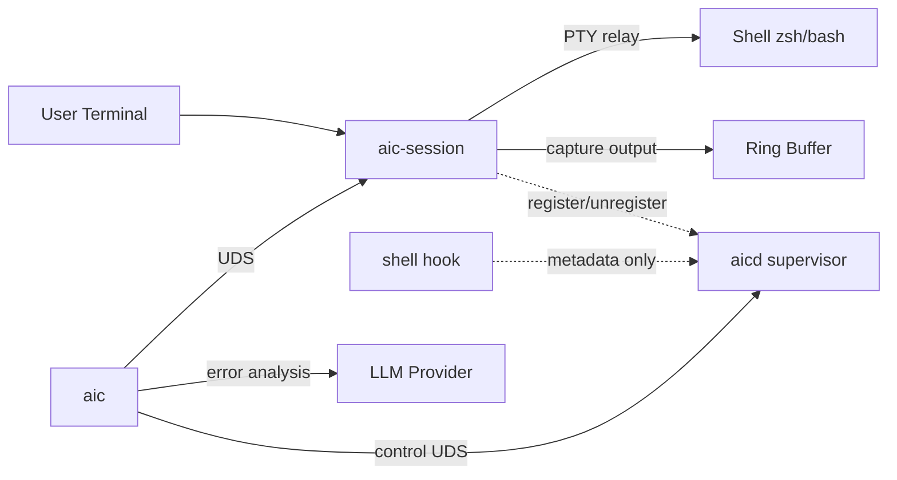

# aic

> A Rust terminal assistant for shell-error analysis and bounded SRE diagnostics.
> It supports OpenAI-compatible, Groq, Anthropic, and CLI backends.

[](https://github.com/x-mesh/aic/actions/workflows/ci.yml)

**Languages:** English · [한국어](./README.ko.md)

## Overview

When a command fails, `aic` sends its output to an LLM. The LLM explains the failure and suggests a fix.

`aic-session` wraps your shell with a PTY and keeps recent output in a ring buffer.
The `aic` client reads the previous exit code. It then explains the error or starts an interactive REPL.

The per-user `aicd` daemon manages session lifecycle, registry, and cleanup.
Metadata-only hook capture skips output capture when PTY wrapping is unsuitable.
Read the [supervisor PRD](docs/PRD-AICD-SUPERVISOR.md) and [hook capture PRD](docs/PRD-HOOK-CAPTURE-MODE.md).


```mermaid
graph LR
    User[User Terminal] --> Session[aic-session]
    Session -->|PTY relay| Shell[Shell zsh/bash]
    Session -->|capture output| RB[Ring Buffer]
    Session -.register/unregister.-> AICD[aicd supervisor]
    Hook[shell hook] -.metadata only.-> AICD
    Client[aic] -->|UDS| Session
    Client -->|control UDS| AICD
    Client -->|error analysis| LLM[LLM Provider]
```

## Features

### Core
- ✅ PTY shell wrapper — captures output without changing your workflow
- ✅ Command boundary detection — OSC 133 markers + timing-heuristic fallback
- ✅ Automatic error analysis — when exit code ≠ 0, the LLM explains the cause and suggests fixes
- ✅ Interactive REPL — when exit code = 0, freeform chat with the LLM
- ✅ `aic chat` agent mode — runs project tools with supported OpenAI-compatible providers
- ✅ Graceful fallback — uses plain chat when the provider does not support tools
- ✅ SRE shell execution — runs bounded read-only diagnostics through `run_command`
- ✅ Confirmation gates — requests approval for state changes and blocks dangerous commands
- ✅ Secret-path protection — blocks sensitive paths, including `~/.ssh`, `/etc/shadow`, and `.env`
- ✅ Read-only option — disable `run_command` with `--no-run`, `--read-only`, or `AIC_AGENT_NO_RUN=1`
- ✅ Multiple LLM providers — OpenAI-compatible, Groq, Anthropic, CLI Backend (kiro-cli, claude-cli)
- ✅ MCP tool servers — expose configured Streamable HTTP tools as `<server>__<tool>`
- ✅ MCP safety gates — auto-approve listed read-only tools and confirm other tools
- ✅ TUI compatibility — alternate-screen-buffer detection keeps vim, htop, etc. working correctly
- ✅ Cross-platform — macOS (Apple Silicon, x86_64), Linux (x86_64, aarch64)

### Reliability & Diagnostics
- ✅ Single-instance guarantee — `fcntl(F_SETLK)` PID lock with automatic stale cleanup
- ✅ Graceful shutdown — SIGTERM/SIGINT handling, drain then cleanup
- ✅ Structured trace logs — JSONL daily-rotate (7-day retention), `AIC_LOG=info|debug`
- ✅ `aic doctor` — 10-axis environment diagnosis (config / provider / socket / daemon / supervisor / OTLP exporter / shell hook / LLM endpoint / keychain / audit). The exporter check reports the last push failure, the per-reason loss counts, and the action to take.
- ✅ `aic status` — daemon PID / ping / last command, one-shot output
- ✅ Proactive chat status bar — samples host metrics off-thread and shows severity, trends, and bounded alerts
- ✅ Deterministic health verdict — `/health` reports healthy, degraded, critical, or `UNKNOWN` without an LLM call
- ✅ Workload discovery — `/discover` identifies supported service processes, ranks monitoring proposals, and lets a TTY user select explicit workload definitions before one confirmation.
- ✅ `aic diagnose` — symptom-driven Safe probes → typed **Findings** (severity / confidence / probe_id). A deterministic threshold scan flags disk / inode / fd / swap exhaustion, kernel OOM-kills, and failed systemd units **without an LLM**; `aic diagnose --json` emits a machine-readable envelope
- ✅ `aic rca` — persistent RCA workspace: incidents under `~/.aic/incidents/<id>/` (`evidence.jsonl` + `report.md`), with `start` / `status` / `timeline` / `report`; `--diagnose` attaches first evidence from the headless `/diagnose` engine
- ✅ Session snapshot recorder (opt-in) — background system snapshots to `~/.aic/snapshots/`, gated by `AIC_SNAPSHOT_RECORD`: alert-triggered full capture (L1), a periodic timer (L2, `aic snapshot install`), and Crit auto-RCA (L3, `AIC_AUTO_RCA`). See [Session snapshot recorder](#session-snapshot-recorder)

### Security baseline
- ✅ Secret/PII redaction — automatic masking for 5 secret types (AWS / GitHub / OpenAI / Anthropic / JWT) and 4 PII types (email / KR phone / KR resident number / IPv4); opt-out via `AIC_REDACT=off`
- ✅ Read-only host diagnostics — inspect logs, `/tmp`, and `/proc` while secret paths remain blocked
- ✅ Egress and mutation gates — confirm or block network access and state changes
- ✅ Audit log HMAC chain — `~/.local/state/aic/audit.log` JSONL append-only, integrity verification via `aic audit verify`. The HMAC key uses a **file backend by default**; the OS keychain is opt-in (`AIC_AUDIT_KEYCHAIN=1`), and `AIC_NO_KEYCHAIN=1` forces it off
  - **Upgrade note**: Set `AIC_AUDIT_KEYCHAIN=1` to continue a keychain-backed chain.
  - Back up or rotate `audit.log` before you start a new file-backed chain. `aic doctor` shows both options.
- ✅ OS keychain — store API keys in macOS Keychain / Linux Secret Service / Windows Credential Manager; bulk migrate plaintext via `aic migrate-keys`

### LLM UX
- ✅ Streaming — token-by-token streaming for OpenAI-compatible **and** Anthropic providers, including the `aic chat` tool-calling agent loop (spinner until the first token → live raw preview → formatted answer on completion); TTY only, opt-out via `AIC_NO_STREAM=1`
- ✅ Result cache — same (cmd, exit, output) for 24h TTL, instant response
- ✅ Dry-run preview — `aic --dry-run "..."` previews tokens, cost, and timeout in advance
- ✅ Retry circuit breaker — after 5 failures within a 60s window, fail-fast for 30s
- ✅ i18n auto-detect — when `lang = "auto"`, infer from `$LC_ALL` / `$LANG`

### Onboarding
- ✅ `aic init zsh|bash` — automatic shell-hook installation (idempotent via markers)
- ✅ `aic init --hook-mode` — additionally install Phase 3 metadata-only hook
- ✅ `aic config` interactive wizard

### Supervisor / Capture Modes
- ✅ `aicd` supervisor daemon — one per user. Session registry, control UDS,
  graceful shutdown
- ✅ `aic daemon { status | start | stop }` — supervisor control
- ✅ `aic session stop <id>` — registry-backed session termination
- ✅ `aic sessions` — aicd registry-first, fallback to socket scan
- ✅ Hook capture mode — collects metadata only via `~/.aic/hook-events.{zsh,bash}`
- ✅ `aic run -- <cmd>` — explicit FullOutput capture wrapper
- ✅ `CommandRecord.capture_mode/quality` + capture-quality hint during analysis

### Roadmap
- 🚧 `aic-proxy` — LLM API proxy server (planned)
- 🚧 Move PTY ownership into `aicd` (full implementation of PRD-AICD-SUPERVISOR Phase 2)

## How it works

1. `aic-session` spawns your default shell as a PTY child process
2. Shell I/O passes through while an ANSI-stripped clean-text copy goes into a ring buffer
3. OSC 133 markers (or a timing heuristic) identify command boundaries and produce a `CommandRecord`
4. When you run `aic`, it queries the previous command's data via UDS
5. Based on exit code it auto-branches into error analysis (LLM) or an interactive REPL

## Quick Start

### Prerequisites

- Rust 1.89+ (2021 edition)
- macOS or Linux
- An LLM API key (OpenAI, Anthropic, Groq, etc.) or a CLI Backend (kiro-cli, claude-cli)

### Build & Install

#### One-line installer (macOS / Linux)

```bash
curl -fsSL https://raw.githubusercontent.com/x-mesh/aic/main/install.sh | sh
```

Detects OS/arch (`linux`/`darwin` × `amd64`/`arm64`), downloads the
matching release archive, verifies its SHA-256 against the published
`checksums.txt`, and installs `aic` + `aic-session` + `aicd` to
`/usr/local/bin` (with sudo fallback) or `~/.local/bin`.

Override targets:

```bash
AIC_VERSION=<tag> sh install.sh         # pin a specific tag
AIC_INSTALL_DIR=$HOME/.local/bin sh ... # install to a user dir
```

After installing, enable autostart once: `aic daemon install`
(auto-branches between macOS launchd and Linux systemd user unit).

#### Homebrew (macOS / Linux)

```bash
brew tap x-mesh/tap
brew install aic
# Enable autostart, once after install:
aic daemon install     # auto-branches between macOS launchd and Linux systemd user unit
```

`brew services` works well with macOS launchd but its Linux-systemd
support is spotty, so `aic daemon install` handles both OSes consistently.

#### Build from source

```bash
git clone https://github.com/x-mesh/aic.git && cd aic
cargo build --workspace --release
cargo install --path aic-server   # installs aic-session + aicd
cargo install --path aic-client   # installs aic
```

Or via Makefile:

```bash
make install
```

Develop / verify:

```bash
cargo check --workspace      # fast type-check
cargo test --workspace       # run the test suite (run before every commit)
make check                   # fast workspace type-check
```

### Self-update

```bash
aic update             # detect install source and upgrade in place
aic update --check     # exit 1 if a newer release is available, 0 otherwise
aic update --to <tag>  # pin a specific tag (manual installs only)
aic update --force     # reinstall even if already on the latest version
```

`aic update` detects how `aic` was installed and chooses the right path:

| Install source | Action |
|---|---|
| Homebrew (`/opt/homebrew`, `/usr/local/Cellar`, linuxbrew) | forwards to `brew upgrade x-mesh/tap/aic` |
| Manual / `install.sh` (`/usr/local/bin`, `~/.local/bin`) | downloads + verifies sha256 + atomic-replaces all 3 binaries (sudo fallback for `/usr/local/bin`) |
| `cargo install` (`~/.cargo/bin`) | refuses self-replace, prints the equivalent `cargo install` command |

After upgrading the binaries on disk, restart `aicd` to pick up the new
version: `aic daemon restart`.

### Configuration

```bash
mkdir -p ~/.config/aic
cp <<'EOF' > ~/.config/aic/config.toml
[server]
max_buffer_lines = 500

[server.boundary_strategy]
method = "prompt_marker"

[llm]
default_provider = "openai"

[llm.providers.openai]
provider_type = "OpenAiCompatible"
endpoint = "https://api.openai.com/v1/chat/completions"
api_key = "sk-..."
model = "gpt-4o"
EOF
```

### Usage

```bash
# 1. First-time setup — config + automatic shell-hook install
aic config             # interactive provider/api_key/model setup
aic init zsh           # idempotently appends 'source ~/.aic/hooks.zsh' to ~/.zshrc
aic migrate-keys       # move plaintext API keys into the OS keychain (optional)
aic doctor             # 10-axis diagnosis — see PASS/WARN/FAIL at a glance
aic doctor --probe-tools  # opt-in live probe: does the provider actually support tool-calling?

# Run the same read-only diagnosis across one host or a host group.
aic diagnose --host web-01 "disk full"
aic diagnose --host @web-tier "high cpu" --json

# 2. (optional) Start the supervisor — central multi-session lifecycle
aic daemon start       # spawns aicd in the background
aic daemon status      # check liveness + registered session count

# 3. Start a shell with aic-session — auto-registers if aicd is up
aic-session

# 4. Use commands as usual
cargo build   # error!

# 5. Analyze the error with aic
aic
# → LLM explains the cause and suggests fix commands (auto-streams in TTY)

# 6. Running aic with no error → REPL mode
aic
# → Freeform chat with the LLM (exit/quit/Ctrl+D to leave)

# 7. Direct question + dry-run for cost preview
aic --dry-run "how do I fix this error?"

# 8. Explicit chat / agent mode (independent of exit code)
aic chat "summarize what this repo does"   # one-shot answer, then exit
aic chat                                    # interactive SRE agent (run_command default-on)
# → With an OpenAI-compatible provider, the agent reads your project via file tools
#   (read_file/list_dir/grep/glob), confined to the cwd sandbox and honoring
#   .gitignore. It can also run BOUNDED shell commands (run_command):
aic chat                                    # then type:  ps        → runs `ps aux | head -n 20`
                                            #             disk      → runs `df -h`
                                            #             cpu/memory/net → bounded OS-friendly command
# → Safe read-only commands run automatically and may inspect the WHOLE host
#   (e.g. `tail /var/log/syslog`, `du -ah /tmp | sort -rh | head`, `find /tmp -mmin -10`),
#   except secret paths (~/.ssh, ~/.aws, /etc/shadow, *.pem, .env) which are blocked.
#   State-changing commands ask for confirmation (TTY); dangerous/unknown are blocked;
#   mutations stay confined to the cwd sandbox. The shell is restricted
#   (no $, globs, quotes, redirects, ;, &, pipes-of-danger).
aic chat --no-run                           # read-only session (no run_command); --read-only is a synonym
AIC_AGENT_NO_RUN=1 aic chat                 # same opt-out via env
AIC_DEBUG=1 aic chat                        # stderr debug: tool_specs/run_command/provider_tools (banner still shown)
NO_COLOR=1 aic chat                         # plain output (no ANSI; also auto on non-TTY)
# → On start, a banner + status line (mode/tools/policy/cwd/provider) prints to stderr.
#   The chat prompt is "◇ you ❯ " on a TTY, plain "you> " when piped. LLM answers go
#   to stdout; banner/status/command-cards/debug go to stderr (clean piping).
# → In-session slash commands are intercepted locally and never sent to the LLM:
#   /local /diagnose /explain-last /incident /rca /doctor /timeline /compare /record /snapshots /bundle /triage /watch /help.
#   Type "/" on a TTY to open the completion panel. See "Chat slash commands" below for the full table.
# (legacy flags --sre / --allow-run still parse but are now no-ops: run_command is on by default)
# Design: docs/PRD-AIC-SRE-CHAT.md · docs/RFC-002-AIC-CHAT-AGENTIC.md
# → Preview cost with: aic chat --dry-run "ping"

# 9. Operations
aic status             # daemon PID / ping / last command
aic sessions           # all active sessions (aicd registry-first)
aic session stop <id>  # terminate a specific session (requires aicd)
aic audit verify       # audit-log HMAC-chain integrity (exit 0/2/3)
aic diagnose <symptom> # symptom-driven read-only diagnosis (add --json for machine output)
aic rca status         # persistent RCA incidents (start / status / timeline / report)
aic snapshot status    # session snapshot recorder (capture / list / status / install / uninstall)
```

### RCA workspace

`aic rca` persists root-cause analysis per incident id. Evidence goes to
`~/.aic/incidents/<id>/evidence.jsonl` and the report to `report.md` in the same directory (evidence
files 0600, incident dirs 0700).

```sh
# create an incident workspace
aic rca start "api latency" --symptom "p99 latency spike"

# attach Safe-probe evidence right after creation
aic rca start "disk full" --diagnose --no-analyze

# recent incidents / status
aic rca status
aic rca status <id-prefix>

# chronological evidence timeline
aic rca timeline <id-prefix>

# markdown report with evidence ids ([E1], [E2]…)
aic rca report <id-prefix> --write
```

P0 scope is `start/status/timeline/report`. `--diagnose` reuses the headless `/diagnose` engine to store
the first RCA evidence, and the report cross-references its conclusions back to evidence ids in an
appendix. Inside `aic chat`, `/rca start|use|add|timeline|report` appends conversation evidence to the
same workspace.

### Session snapshot recorder

Persistently record system snapshots to `~/.aic/snapshots/` so you can look back at what the host looked
like *before* an incident. **Opt-in** — nothing is written unless `AIC_SNAPSHOT_RECORD=1` (or `/record
on` inside a chat). Each snapshot is the same redacted evidence as `/local`, appended as JSONL (file
0600, newest 200 kept), in a silo separate from `aic rca` incidents.

Four layers, each independently gated:

- **L0** — `/compare` snapshots are appended while recording is on.
- **L1** — the `aic chat` status-bar sampler captures a full `/local` snapshot when a resource worsens
  (Normal→Warn/Crit), off-thread so a hung mount never blocks the UI.
- **L2** — a periodic capture timer (`aic snapshot install`, macOS launchd / Linux systemd-user) plus a
  manual CLI.
- **L3** — on a Crit transition, `AIC_AUTO_RCA=1` auto-creates an RCA incident from collected evidence
  (no LLM call).

```sh
aic snapshot capture                  # one capture honoring the opt-in gate (--force ignores it)
aic snapshot list --json              # recent snapshots (metadata envelope; bodies never printed)
aic snapshot status --json            # recorder + timer status
aic snapshot install --interval 300   # install the periodic timer (interval clamped to ≥60s)
aic snapshot uninstall
```

Inside `aic chat`, `/record [on|off|now]` toggles recording for the session (`now` = capture once,
bypassing the gate) and `/snapshots [N]` lists the most recent N (default 10). While recording, a red
`● REC` segment leads the status bar. Concurrent writers (the off-thread capture vs. the session's
`/compare` append) are serialized by a process-internal mutex plus a cross-process flock, so no writes
are lost.

### Chat slash commands

Inside `aic chat`, lines starting with `/` are intercepted locally — they are **never sent to the LLM**
and never enter the chat history; their output goes to the screen (stderr) only. On a TTY, typing `/`
opens a candidate panel (↑↓ to move, Tab to cycle, Enter to pick, Esc to close).

| Command | What it does |
|---------|--------------|
| `/help` | List the available slash commands |
| `/health` | Deterministic machine `HEALTHY` / `DEGRADED` / `CRITICAL` verdict with explicit `UNKNOWN` coverage; attaches evidence to the active RCA |
| `/discover [--raw]` | Find supported workloads and show monitoring proposals. In a TTY with command execution enabled, select definitions with ↑↓ and Space, then confirm persistence with `y`. `--raw` shows the complete process inventory without Generic monitoring proposals. |
| `/workload inspect <id>` | Show a discovered workload candidate, its selector, bindings, ambiguity, and proposals. |
| `/workload enable <id> <fingerprint>` | Save one explicit workload definition after confirmation. The candidate must keep the same fingerprint and have a stable, unambiguous selector. |
| `/last [N]` | Show the last tool card, or a compact list of the last N tool calls |
| `/raw [seq\|corr]` | Full redacted output of the last (or a specific) tool call |
| `/local [section] [--raw]` | Local sysinfo snapshot → LLM summary (`--raw` = evidence only). alias: `/sys`, `/snapshot` |
| `/diagnose [--raw] <symptom>` | Pick Safe probes from the symptom, collect evidence, analyze → hypotheses / cited evidence / next safe checks |
| `/explain-last [--raw] [seq\|corr]` | Analyze the last (or given) tool record: cause candidates / evidence / next checks |
| `/incident [--raw] [name]` | Bundle system snapshot + git read-only evidence (in a repo) + recent records, then analyze. `name` is a label only |
| `/doctor` | AIC self-status: provider/model, tool-calling support, run_command on/off, env flags as set/unset only (no secret values) |
| `/timeline [N]` | Session tool records in chronological order (redacted) |
| `/compare` | Diff a fixed-Safe system snapshot against the previous baseline (no LLM) |
| `/record [on\|off\|now]` | Toggle session snapshot recording (`now` = capture once, bypassing the gate). See [Session snapshot recorder](#session-snapshot-recorder). While on, a red `● REC` leads the status bar |
| `/snapshots [N]` | List the most recent N (default 10) recorded snapshots inline (metadata only; bodies never shown) |
| `/bundle [name]` | Save incident evidence as redacted markdown under `~/.aic/bundles/` (dir 0700 / file 0600 on Unix) |
| `/rca start\|use\|add\|timeline\|report` | Save chat evidence to a persistent RCA workspace. e.g. `/rca start api-latency`, `/rca add last 3`, `/rca add note ...`, `/rca report --write`. See [RCA workspace](#rca-workspace) |
| `/triage [--run] [topic]` | Topic checklist + candidate probes from the Probe Catalog; `--run` executes them (no LLM). topics: `mac-slow web disk memory cpu network build-fail docker generic` (the `disk` topic also checks docker disk usage and big `/tmp` files) |
| `/watch [target] [--count N] [--every Ns]` | Re-run probes a few times and summarize what changed per tick (no LLM). Bounded: default 3 runs (max 20), interval 1s. `target` is any Probe Catalog id — LOCAL sections, `docker_df`/`docker_ps`, `tmp_big`/`tmp_recent` — e.g. `/watch tmp_recent` tracks files growing under `/tmp`; omit it for a compact set |
| `/watch arm` \| `/watch off` | Toggle the proactive alert lane (default on). When armed, a worsening resource transition (Normal→Warn/Crit) drops a one-line ambient note into the chat (Crit also rings a bell) and recovery prints a `✓` line. `off`/`mute` silences it. Distinct from the bounded-probe `/watch <target>` above |

### Workload monitoring

Discovery does not start monitoring. It only creates candidates from the current process inventory.

Use this lifecycle:

1. Run `aic workload discover --json` to find candidates.
2. Run `aic workload inspect <id> --json` to check one candidate.
3. Run `aic workload enable <id> --fingerprint <value> ...` to save a definition.
4. Run `aic workload list --json` to verify saved definitions.
5. Run `aic workload monitor <id> --json` to test one probe.
6. Run `aic daemon start` to collect samples every 60 seconds.
7. Run `aic workload status --json` and `aic workload history <id> --limit 20 --json`.

The daemon reads saved definitions. It does not discover new processes automatically.

A running daemon loads a new definition on the next collection cycle. This delay can take 60 seconds.

PostgreSQL, MySQL or MariaDB, MongoDB, Nginx, and HAProxy require explicit connection options.

Use only `unix:///absolute/path`, `tcp://host:port`, or `tls://host:port` endpoints. The adapter can impose stricter rules.

The following status values describe collection state:

- `fresh`: A sample exists from the last 180 seconds.
- `stale`: The newest sample is older than 180 seconds.
- `no_samples`: A definition exists, but no sample exists.
- `ambiguous_definitions`: Multiple definitions prevent collection for that adapter.
- `not_collected`: The adapter supports discovery only.

Thirteen adapters support monitoring. JVM, Kafka, and Consul support discovery only.

Read [Workload monitoring](docs/WORKLOAD-MONITORING.md) for adapter metrics, authentication, TLS rules, limits, paths, and examples.

### Remote hosts and groups

Define hosts and groups in `~/.aic/hosts.toml`. AIC can also import entries from `~/.ssh/config`.

```bash
aic hosts show
aic hosts trust web-01
aic hosts ping web-01 --cmd "uptime"
aic hosts ping @web-tier --cmd "df -h"
aic diagnose --host @web-tier "high cpu" --json
```

Remote execution uses SSH batch mode and read-only commands. Group execution applies concurrency and timeout limits.

### Safety model (run_command)

`aic chat` classifies every shell command before running it and never weakens the guard:

| Tier | Behavior | Examples |
|------|----------|----------|
| **Safe** | Runs automatically | `ps aux`, `df -h`, `cat`, `grep`, `dig name` |
| **NeedsConfirm** | TTY confirm (rejected when non-interactive) | `systemctl restart`, `git commit`, `curl https://…` (any network egress) |
| **Dangerous** | Blocked | `rm -rf`, `mkfs`, `dd`, `ssh`/`scp`/`nc` (remote/arbitrary network) |
| **Unknown** | Blocked (conservative) | unparseable / subshell `$(…)` |

Safe read-only commands can inspect host-wide paths. Secret paths remain blocked, including symlink targets.

Mutation commands stay inside the current working directory. All commands use a minimal environment allowlist.

Output limits, process-group timeouts, and secret redaction apply before data reaches the LLM, screen, or audit log.

Disable shell execution with `--no-run`, `--read-only`, or `AIC_AGENT_NO_RUN=1`. Read-only file tools remain available.

### Optional: Hook capture mode (metadata only, no PTY wrapper)

When you want to collect command metadata without paying the PTY-wrapping cost:

```bash
aic daemon start                    # aicd required (receives hook events)
aic init zsh --hook-mode            # installs ~/.aic/hook-events.zsh
exec zsh                            # new shell → preexec/precmd hooks active

# Run commands as usual — metadata accumulates without aic-session
ls -la
cargo build

# Use explicit capture only when exact output is needed
aic run -- cargo build              # preserves stdout/stderr and exit code
```

### Agent environment controls

| Variable | Effect |
|---|---|
| `AIC_LOG=info|debug|trace` | aic-session/aicd tracing level (default info) |
| `AIC_REDACT=off` | disable secret/PII redaction (recorded in audit) |
| `AIC_NO_STREAM=1` | disable token streaming (error analysis **and** the `aic chat` agent loop); show the full answer at once |
| `AIC_DEBUG=1` | client emits `[debug +X.XXXs]` prefix |
| `AIC_AUDIT_KEYCHAIN=1` | store the audit HMAC key in the OS keychain (opt-in). **Default is a file key** |
| `AIC_NO_KEYCHAIN=1` | force keychain off (highest priority) — overrides the opt-in; always uses the file key |
| `AIC_LOCAL_NO_ANALYZE=1` | skip analysis for `/local`·`/diagnose` etc.; show raw evidence only |
| `AIC_NO_BANNER=1` / `AIC_QUIET=1` | suppress the `aic chat` startup banner, status line, and context header (this chrome is unrelated to debug output) |
| `AIC_VERBOSE=1` | show the detailed per-command `run_command` cards (preamble + `→ done` summary). Default is quiet (only section headers + security warnings). `AIC_DEBUG=1` also enables them |
| `AIC_SESSION_ID` | active session ID. Exported automatically by `aic-session`; hooks reference it too |

## Project Structure

```
aic/
├── aic-common/                      # shared data models, IPC protocol, errors
│   └── src/
│       ├── lib.rs                   # CommandRecord (+ capture_mode/quality),
│       │                            # SessionInfo/SessionState, SessionConfig,
│       │                            # AppConfig, capture_quality_hint()
│       ├── ipc.rs                   # IpcRequest/Response — session/control/hook
│       ├── error.rs                 # AicError
│       ├── workload.rs              # workload definitions and samples
│       └── paths.rs                 # session_socket_path, aicd_socket_path,
│                                    # aicd_lock_path
├── aic-server/                      # two binaries: aic-session + aicd
│   └── src/
│       ├── main.rs                  # aic-session: PTY wrapper + register/
│       │                            # unregister to aicd
│       ├── aicd_main.rs             # aicd: singleton + control UDS + signal
│       ├── control_server.rs        # aicd control plane (RingBuffer-free)
│       ├── session_registry.rs      # in-memory HashMap registry
│       ├── hook_events.rs           # per-session bounded ring (Phase 3)
│       ├── aicd_client.rs           # aic-session → aicd best-effort RPC
│       ├── workload_monitor.rs       # periodic service-level probes
│       ├── pty_manager.rs / output_processor.rs / boundary_detector.rs /
│       │   ring_buffer.rs / uds_server.rs / lock.rs / metrics.rs / telemetry.rs
├── aic-client/                      # CLI client (binary: aic)
│   └── src/
│       ├── main.rs                  # clap CLI entry point and subcommands
│       ├── hook_install.rs          # zsh/bash hook script generator (Phase 3)
│       ├── uds_client.rs            # session UDS + aicd control client
│       ├── doctor.rs                # 10-axis diagnosis (incl. aicd supervisor, OTLP exporter)
│       ├── workload.rs              # workload CLI behavior
│       ├── agent/
│       │   ├── hosts.rs              # remote host and group inventory
│       │   └── mcp.rs                # MCP Streamable HTTP client
│       ├── config.rs / auto_brancher.rs / error_analyzer.rs /
│       │   llm_dispatcher.rs / repl.rs / cache.rs / redaction.rs /
│       │   audit.rs / keychain.rs / streaming.rs / spinner.rs / top.rs
├── docs/                            # PRDs, capture-mode trade-offs
├── Cargo.toml                       # workspace definition
└── Makefile
```

## Configuration file

Config file path: `~/.config/aic/config.toml` (XDG Base Directory compliant)

```toml
[server]
max_buffer_lines = 500
# socket_path = "/custom/path/session.sock"  # optional: override the socket path

[server.boundary_strategy]
method = "prompt_marker"           # "prompt_marker" or "timing_heuristic"
# idle_threshold_ms = 500          # idle threshold when using timing_heuristic

[llm]
default_provider = "openai"        # default provider name

# ── OpenAI-compatible (OpenAI, NVIDIA, etc.) ──
[llm.providers.openai]
provider_type = "OpenAiCompatible"
endpoint = "https://api.openai.com/v1/chat/completions"
api_key = "sk-..."
model = "gpt-4o"

[llm.providers.nvidia]
provider_type = "OpenAiCompatible"
endpoint = "https://integrate.api.nvidia.com/v1/chat/completions"
api_key = "nvapi-..."
model = "meta/llama-3.1-70b-instruct"

# ── Groq (OpenAI-compatible — defaults applied automatically when endpoint/model are omitted) ──
[llm.providers.groq]
provider_type = "Groq"
api_key = "gsk_..."
model = "llama-3.3-70b-versatile"
# When endpoint is omitted, https://api.groq.com/openai/v1/chat/completions is used.
# Other models: llama-3.1-8b-instant · deepseek-r1-distill-llama-70b · gemma2-9b-it

# ── Anthropic ──
# Model IDs: see https://docs.anthropic.com/en/docs/about-claude/models
# Recommended: claude-opus-4-7 (most capable), claude-sonnet-4-6 (balanced, default),
#              claude-haiku-4-5-20251001 (cheap/fast).
# Retired models can return 404. Update them to the IDs above.
[llm.providers.anthropic]
provider_type = "Anthropic"
endpoint = "https://api.anthropic.com/v1/messages"
api_key = "sk-ant-..."
model = "claude-sonnet-4-6"

# ── CLI Backend (local CLI tools) ──
[llm.providers.kiro-cli]
provider_type = "CliBackend"
cli_path = "kiro"

[llm.providers.claude-cli]
provider_type = "CliBackend"
cli_path = "claude"

# ── Observability backends (SRE) ──
# The agent can query only registered backends. The LLM selects a backend name, not a URL.
# Redirect and link-local blocking reduce SSRF risk.
[observability.backends.prom]
backend_type = "Prometheus"
url = "http://prometheus:9090"
# auth = "keychain:obs_prom"

[observability.backends.logs]
backend_type = "Loki"
url = "http://loki:3100"

[observability.backends.es]
backend_type = "Elasticsearch"
url = "http://elasticsearch:9200"
```

Use registered backends from `aic chat`:

```sh
/metrics up
/metrics -b prom rate(http_requests_total[5m])
/logs {app="api"} |= "error"
```

Natural-language requests can call `prometheus_query`, `loki_query`, or `es_search`.

### MCP servers

`aic chat` can call tools from [Model Context Protocol](https://modelcontextprotocol.io) servers.
The current transport is Streamable HTTP. Each tool uses a `<server>__<tool>` name.

```toml
[mcp.servers.mem-mesh]
url = "http://127.0.0.1:8787/mcp"
# enabled = true
# auth = "keychain:mem-mesh"
auto_approve = ["search", "context", "get_links", "stats"]
```

Tools in `auto_approve` run without confirmation. Other tools require confirmation before execution.

Tool results receive redaction and size limits before they reach the LLM.

### Webhook alert ingestion

`aicd` receives Alertmanager, Grafana, PagerDuty, and generic webhooks.
It can run `aic diagnose --bundle` for each active alert. The listener is disabled by default.

```toml
[aicd.webhook]
enabled = true
listen_addr = "127.0.0.1:9099"
secret = "shared-secret"
rate_limit_per_min = 10
dedup_ttl_secs = 300
auto_diagnose = true
```

If you set a secret, send one authentication header:

- `Authorization: Bearer <secret>`
- `X-AIC-Signature: <hex HMAC-SHA256(secret, body)>`

```sh
aic webhook list
aic webhook list --json
```

Read [SRE use cases](docs/SRE-USE-CASES.md) and [SRE scope boundaries](docs/SRE-SCOPE-BOUNDARY.md).

### Headless and air-gapped servers

Headless commands work without a TTY or GUI. CI checks non-interactive diagnosis, audit, and webhook paths.

- Non-interactive commands reject actions that require confirmation.
- Set `AIC_NO_KEYCHAIN=1` when Linux Secret Service is unavailable.
- Register an internal OpenAI-compatible endpoint for air-gapped use.

```toml
[llm.providers.internal]
provider_type = "OpenAiCompatible"
endpoint = "http://llm.internal:8000/v1/chat/completions"
api_key = "keychain:internal"
model = "qwen2.5-coder"
```

## Environment Variables

| Variable | Description | Default |
|------|------|--------|
| `XDG_CONFIG_HOME` | config-file directory | `~/.config` |
| `XDG_RUNTIME_DIR` | socket path (Linux) | `/tmp/aic-{uid}` |
| `AIC_RUNTIME_DIR` | **absolute** path pinning the runtime directory (sockets, lock, registry). Disables candidate discovery — nothing else is scanned. Use it to isolate instances that share `/tmp` and a uid (e.g. containers). `aic daemon install` copies the value into the systemd unit / launchd plist; `aic doctor` warns when the two disagree. Relative paths are ignored. | unset (convention discovery) |
| `AIC_SESSION_ID` | active session identifier — `aic-session` exports it into the shell. Clients (`aic`/`status`/`doctor`/`top`) use it to locate the socket. | (auto-generated) |
| `AIC_NO_RUN` | when set, disables the inline-run prompt for LLM-suggested commands | unset |
| `AIC_AUTO_RUN` | when `1`, auto-runs without an inline-run prompt (excluding destructive commands) | unset |
| `AIC_DEBUG` | when `1` or `true`, emits `[debug +X.XXXs]` logs to stderr (agent loop adds structured `provider_tools=…` / `tool_specs=…` lines; banner still shown) | unset |
| `AIC_AGENT_NO_RUN` | when `1` or `true`, runs `aic chat` in read-only mode (disables `run_command`; same as `--no-run`/`--read-only`) | unset |
| `NO_COLOR` | when set, suppresses ANSI colors in `aic chat` banner/status/cards/debug (also auto-suppressed on non-TTY stderr) | unset |
| `AIC_REDACT` | when `1`, masks secrets/PII in the prompt right before sending to the LLM | unset |
| `AIC_NO_STREAM` | when set, disables streaming responses (received and displayed all at once) | unset |

## Socket paths (multi-session)

Running `aic-session` from multiple terminals creates an independent socket for each.

| Platform | Path pattern |
|--------|-----------|
| any (`AIC_RUNTIME_DIR` set) | `$AIC_RUNTIME_DIR/session-{id}.sock` |
| macOS | `/tmp/aic-{uid}/session-{id}.sock` |
| Linux (XDG set) | `$XDG_RUNTIME_DIR/aic/session-{id}.sock` |
| Linux (XDG unset) | `/tmp/aic-{uid}/session-{id}.sock` |

Runtime directories must be owned by you and mode `0700`; aic creates them that way and
refuses to bind into a directory that fails the check (`/tmp/aic-{uid}` lives under a
world-writable `/tmp`, so another local user can create it first). Connections are also
verified by peer uid on both ends — connecting to a daemon running as a **different uid**
is rejected, including `sudo -E aic …` inheriting `XDG_RUNTIME_DIR`.

`{id}` is a 16-hex identifier auto-generated by `aic-session` (exported as the `AIC_SESSION_ID` env var).

### Client session-resolution priority
How `aic status` / `aic doctor` / `aic top` etc. pick a session:

1. `--session <id>` (explicit argument)
2. `$AIC_SESSION_ID` (shell export — typically automatic)
3. `config.server.socket_path` (user override)
4. Most recently mtime-updated `session-*.sock` (auto-pick the active session)
5. Legacy `session.sock` (backwards compatibility)

Use `aic sessions` or `aic status --all` to see the full list.

## IPC Protocol

JSON-over-UDS communication between server and client. Length-prefixed framing:

```
[4 bytes: payload length (u32 big-endian)][JSON payload]
```

Session daemon (`aic-session`) socket:

| Request | Description |
|---------|------|
| `GetLastCommand` | retrieve the previous command's CommandRecord |
| `GetRecentLines { count }` | retrieve the last N lines of text |
| `Ping` / `GetMetrics` | health / metrics |

Supervisor (`aicd`) control socket:

| Request | Description |
|---------|------|
| `Ping` | aicd health |
| `ListSessions` | every SessionInfo in the registry |
| `RegisterSession(SessionInfo)` | register a session (called by aic-session) |
| `UnregisterSession { id }` | deregister a session |
| `StopSession { id }` | SIGTERM the registry's PID |
| `Shutdown` | aicd graceful termination |
| `CommandStarted/Finished` | metadata events sent by the shell hook |

Sending to the wrong socket returns a graceful `Error` response ("connect to the aicd socket").

## Development guide

### Build

```bash
make              # debug build
make release      # release build (optimized)
make check        # quick compile check
```

### Test

```bash
make test         # full test suite
make test-unit    # unit tests only
make e2e          # E2E tests only
make test-prop    # property-based tests (1024 cases)
make test-pty     # PTY integration tests (requires a terminal)
```

### Lint

```bash
make lint         # clippy + fmt check
make fix          # autofix
```

### Run (development mode)

```bash
make run-server   # run aic-session
make run-client   # run aic
make run-config   # run aic config
```

### Misc

```bash
make ci           # reproduce CI locally (lint + test)
make doc          # generate and open rustdoc
make loc          # lines-of-code statistics
make deps         # dependency tree
make help         # full command list
```

## Tech stack

| Area | Technology |
|------|------|
| Language | Rust (2021 edition) |
| PTY management | `portable-pty` |
| Async runtime | `tokio` |
| HTTP client | `reqwest` (rustls) |
| IPC | Unix Domain Socket (`tokio::net::UnixListener`) |
| Serialization | `serde` + `serde_json` / `toml` |
| CLI parsing | `clap` |
| ANSI stripping | `strip-ansi-escapes` |
| Testing | `proptest` (property-based testing) |

## License

MIT. See [LICENSE](./LICENSE).
